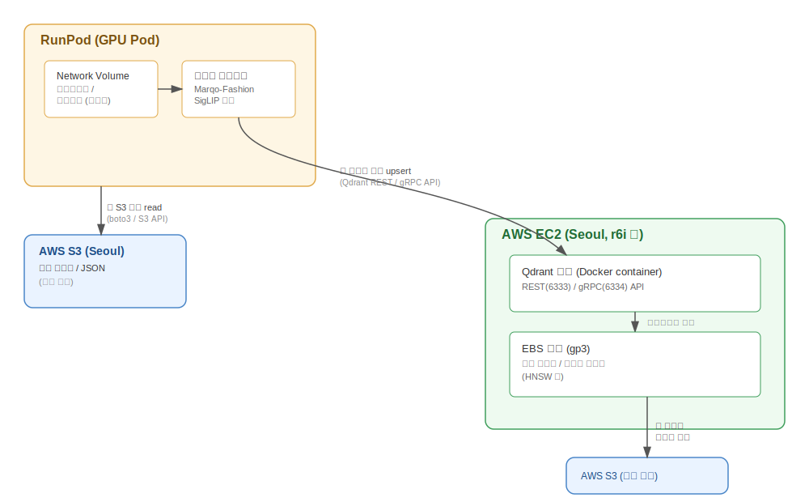

# Fashion RAG 임베딩 파이프라인 아키텍처 문서

**대상**: RunPod(GPU 임베딩) + AWS S3(원본 저장) + AWS EC2/EBS(Qdrant 서빙) 구조
**작성일**: 2026-07-08
**범위**: 한 자리수 TB급 벡터 데이터, Marqo-FashionSigLIP 임베딩, Naver Shopping 크롤링 데이터

---

## 1. 전체 아키텍처 흐름

---

## 2. 단계별 상세 흐름

### 2-1. 초기 세팅 (1회성)

1. **RunPod Network Volume 생성**
   - 데이터센터 선택 (지연시간을 고려해 S3 리전과 가까운 곳 선호되나, 어차피 인터넷 경유이므로 절대적 제약은 아님)
   - 용량: 라이브러리(PyTorch, transformers, marqo 관련 패키지) + 소스코드 정도면 수십 GB 수준으로 충분
   - Standard 티어로 충분 (임베딩 자체는 GPU 연산이 병목이지 스토리지 I/O가 병목이 아님)

2. **AWS EC2 + Qdrant 세팅**
   - EC2 인스턴스 타입: 메모리 최적화 계열(`r6i.xlarge`~) 또는 데이터 규모/쿼리 패턴에 따라 범용 계열
   - EBS gp3 볼륨을 별도로 생성해 Qdrant 데이터 디렉토리에 마운트
   - Qdrant Docker 컨테이너 실행, 데이터 볼륨을 EBS 마운트 경로로 지정
   - **보안 설정 (중요)**: Qdrant는 기본적으로 인증이 없으므로, RunPod에서 외부 네트워크로 접근하려면 반드시:
     - API 키 인증 활성화 (`QDRANT__SERVICE__API_KEY`)
     - TLS(HTTPS) 적용 — 임베딩 벡터가 네트워크로 오가므로 암호화 권장
     - 보안 그룹에서 6333(REST)/6334(gRPC) 포트를 RunPod 대역 또는 전체 허용 후 API 키로 방어 (RunPod는 고정 IP 대역이 아니므로 IP 화이트리스트보다는 API 키 + TLS 조합이 현실적)

3. **IAM 및 S3 접근 권한**
   - RunPod Pod에서 S3에 접근하려면 AWS Access Key/Secret Key 발급 (RunPod는 AWS 내부 IAM 역할을 쓸 수 없으므로 액세스 키 방식 필요)
   - 읽기 전용 권한만 부여된 IAM 정책 사용 권장 (원본 데이터 실수 삭제/수정 방지)

### 2-2. 반복 실행 흐름 (임베딩 배치 작업마다)

| 단계 | 위치 | 작업 |
|---|---|---|
| ① | RunPod Pod 시작 | Network Volume에서 라이브러리/코드 로드 (재설치 불필요) |
| ② | RunPod → S3 | boto3 등으로 원본 이미지/메타데이터 배치 단위로 read |
| ③ | RunPod (GPU) | Marqo-FashionSigLIP으로 임베딩 계산 |
| ④ | RunPod → EC2 Qdrant | 계산된 벡터를 배치로 묶어 Qdrant API(`upsert_points`)로 전송 |
| ⑤ | EC2 내부 | Qdrant가 수신한 벡터를 HNSW 인덱스에 반영, EBS에 영구 저장 |
| ⑥ | (주기적) | Qdrant 스냅샷 생성 → S3 백업 버킷으로 export |

### 2-3. 배치 전송 시 고려사항

- **배치 크기**: 벡터를 1건씩 upsert하면 네트워크 왕복(RTT) 비용이 커짐. 수백~수천 건 단위로 묶어서 `upsert` 호출하는 게 효율적
- **재시도 로직**: RunPod ↔ AWS는 인터넷 경유이므로 일시적 네트워크 장애 가능. 실패한 배치에 대한 재시도/멱등성(같은 point ID로 재전송 시 덮어쓰기) 확보 필요
- **네트워크 비용**: S3 → RunPod egress 트래픽에 AWS 데이터 전송 비용 발생 (원본 데이터가 한 자리수 TB급이면 무시할 수 없는 금액이 될 수 있음). 재처리를 자주 하지 않도록 임베딩 결과와 원본 매핑을 잘 관리하는 것이 비용 절감에 중요

---

## 3. 역할 요약

| 컴포넌트 | 역할 | 위치 |
|---|---|---|
| RunPod Network Volume | 임베딩 코드/라이브러리 영구 저장 (소규모) | RunPod |
| RunPod GPU Pod | 임베딩 연산 (Marqo-FashionSigLIP) | RunPod |
| S3 (원본 버킷) | 크롤링 이미지/JSON 원본 저장, 읽기 전용 접근 | AWS Seoul |
| EC2 | Qdrant 서버 구동 | AWS Seoul |
| EBS (gp3) | Qdrant 벡터 인덱스/컬렉션 영구 저장 | AWS Seoul (EC2에 마운트) |
| S3 (백업 버킷) | Qdrant 스냅샷 백업 | AWS Seoul |

---

## 4. 체크리스트

- [ ] Qdrant API 키 인증 + TLS 설정
- [ ] RunPod용 S3 읽기 전용 IAM 액세스 키 발급
- [ ] Qdrant upsert 배치 크기 및 재시도 로직 구현
- [ ] EBS 볼륨 사이즈 및 gp3 IOPS/처리량 사전 산정 (벡터 차원 × 예상 개수 기준)
- [ ] Qdrant 스냅샷 자동화 및 S3 백업 주기 설정
- [ ] RunPod → AWS 간 데이터 전송(egress) 비용 추정
