# 체형·비율 처방 매트릭스

> `rules/body_fit_rules.json`과 `rules/body_shape_thresholds.json`을 사람이 빠르게 참조할 수 있도록 표로 정리했다. **직접 수정하지 말 것** — 규칙을 바꾸려면 JSON을 고친다.

◎ 권장 · ○ 허용 · △ 주의 · ✕ 기피

---

## 1. 가로축 — 5체형 (측정 가능, 181명 SizeKorea 실측 기반)

| 체형                         | 신호                                       | 상의 (권장 / 기피)           | 하의 (권장 / 기피)             | 핵심 목표             |
| ---------------------------- | ------------------------------------------ | ---------------------------- | ------------------------------ | --------------------- |
| **역삼각형**           | `shoulder/hip` 상위 33%                  | 레귤러·슬림 /**오버** | 와이드·레귤러 /**슬림** | 상체 폭↓ 하체 볼륨↑ |
| **삼각형** (하체 발달) | `shoulder/hip` 하위 33%                  | 오버·레귤러 /**슬림** | 레귤러 /**와이드**       | 상체 볼륨↑ 하체 정돈 |
| **모래시계형**         | `waist/hip` 하위 33% + 어깨·엉덩이 균형 | 레귤러·슬림 /**오버** | 레귤러·슬림·와이드 (모두 OK) | 허리선 노출           |
| **직사각형**           | `shoulder/hip`·`waist/hip` 모두 중간  | 레귤러·오버                 | 와이드·레귤러                 | 허리 위치 인공 생성   |
| **라운드형**           | `waist/hip` 상위 33%                     | 레귤러 /**슬림·오버** | 레귤러·와이드 /**슬림** | 세로선 강조           |

### 5체형 비율 시각화 (SizeKorea 실측 기반 일러스트)

> 각 실루엣의 점선은 shoulder / waist / hip 측정 레벨. 같은 키·정면 view로 폭 차이만 비교되도록 그렸다.

**5체형 통합 비교**

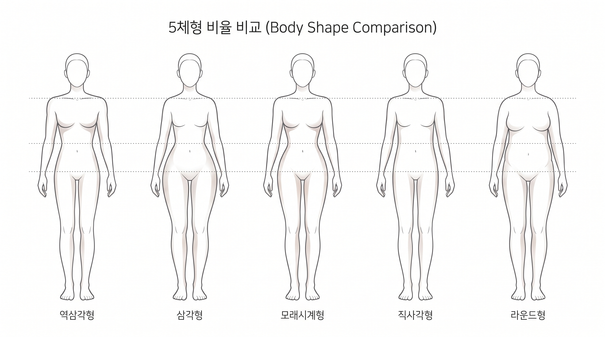

**체형별 상세**

| 체형 | 실루엣 | 비율 신호 |
| --- | :---: | --- |
| **역삼각형** | 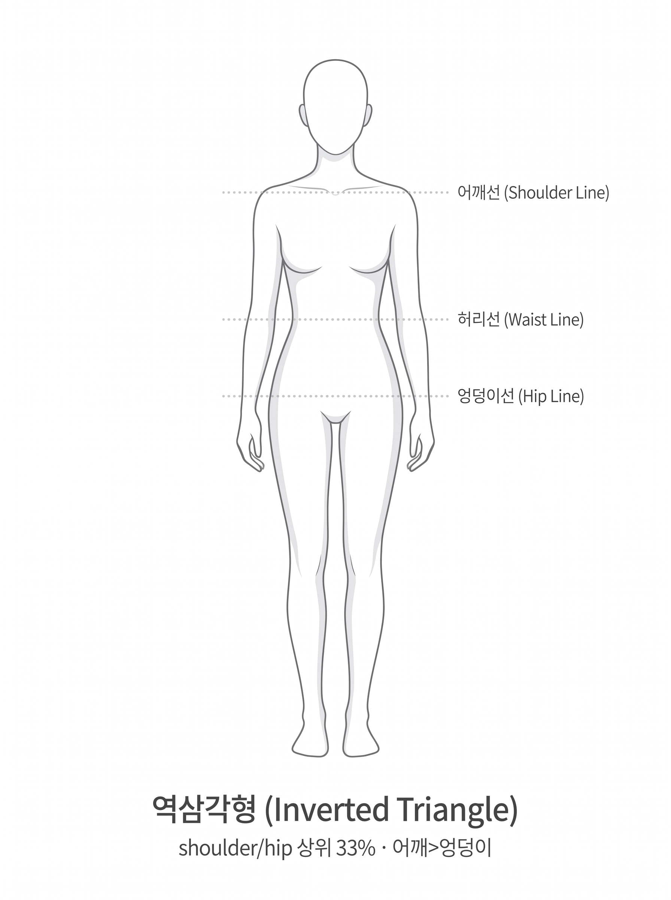 | `shoulder/hip` 상위 33% (어깨 > 엉덩이) |
| **삼각형** (하체 발달) | 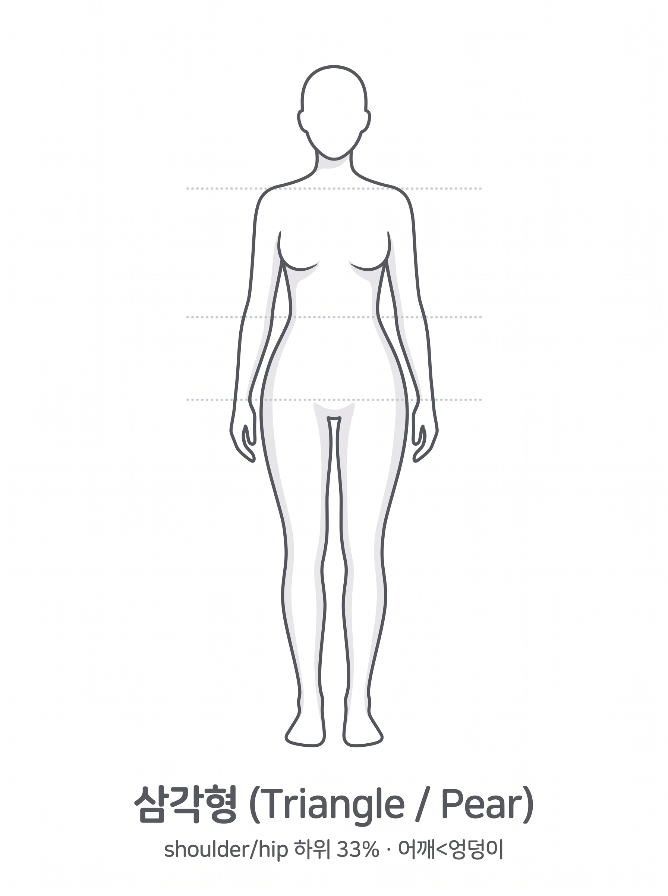 | `shoulder/hip` 하위 33% (어깨 < 엉덩이) |
| **모래시계형** | 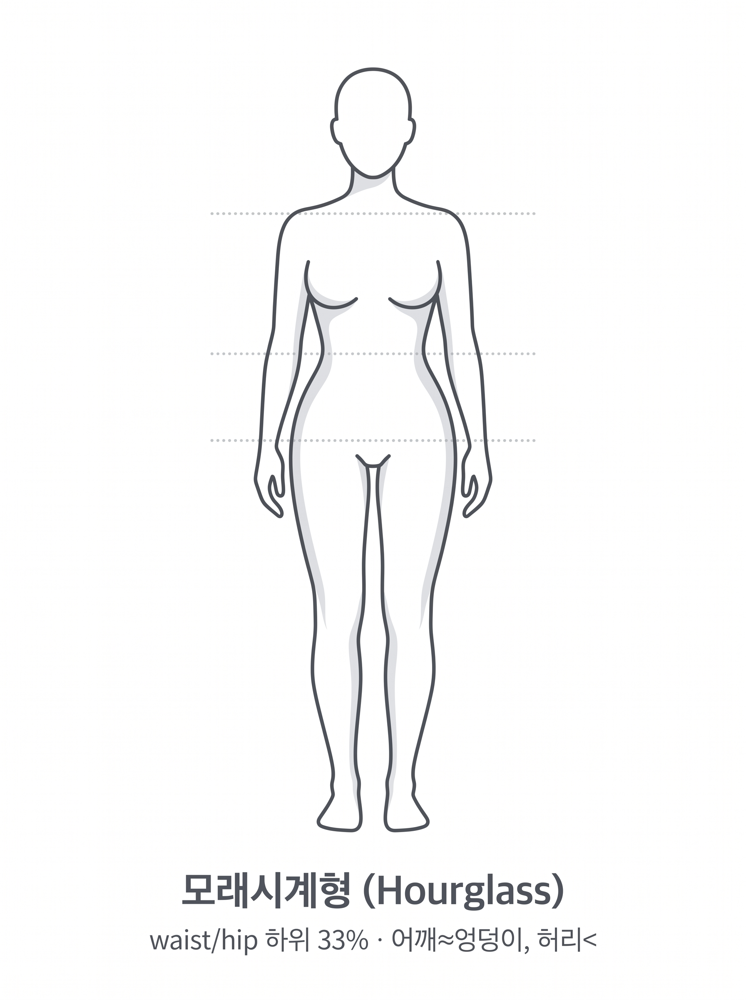 | `waist/hip` 하위 33% + 어깨 · 엉덩이 균형 |
| **직사각형** | 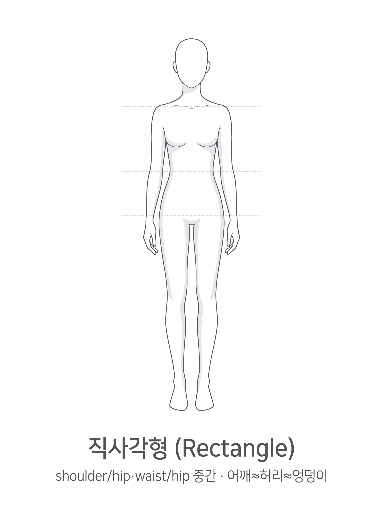 | `shoulder/hip` · `waist/hip` 모두 중간 |
| **라운드형** | 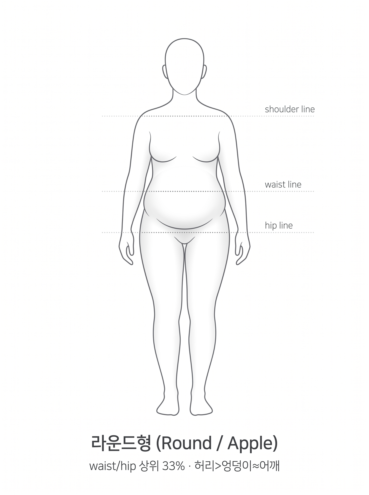 | `waist/hip` 상위 33% (허리 > 엉덩이 ≈ 어깨) |

### 5체형 × 성별 (남녀 비교 통합 차트)

> 같은 체형 비율을 남녀가 어떻게 다른 외형으로 구현하는지 한 장에 비교. 비율 신호(`shoulder/hip`, `waist/hip`)는 동일하게 유지하되 골격·곡선·근육감만 성별에 따라 다르다.

**여자 5체형 비율 비교**

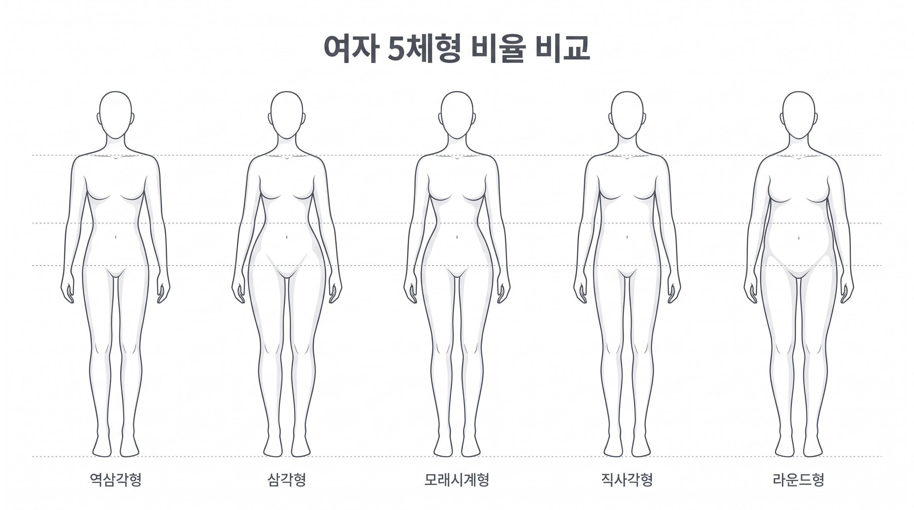

**남자 5체형 비율 비교**

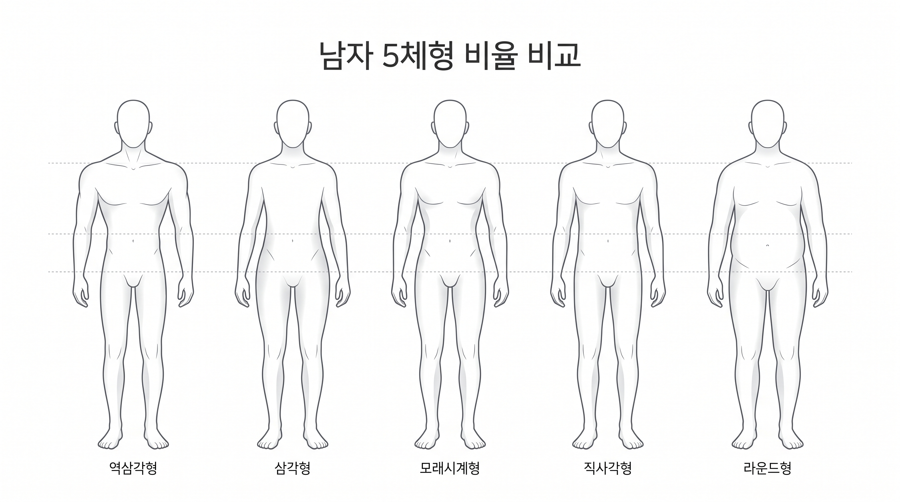

### 5체형 × Plus-Size (가로축 비교 차트)

> 동일한 체형 비율 신호(어깨/허리/엉덩이 비율)를 갖되, 실제 신체 부피와 볼륨이 다르게 나타나는 경우(Slim Baseline vs Plus-Size)를 대조하는 차트입니다. Pinterest 6체형 가이드라인의 Apple과 Oval 유형은 본 분류의 라운드형(sub-type A/B)으로 흡수/매핑되었습니다.

**여자 5체형 × Plus-Size 비교**


### 역삼각형 × BMI × 성별 (BMI 매트릭스 통합 차트)

> 역삼각형 한 체형 안에서 BMI 5구간(아시아-태평양 WHO 기준)을 가로질러 보았을 때 같은 비율 신호(`shoulder/hip` 상위 33%)가 어떻게 두께로 발현되는지 본다. 어깨 > 엉덩이 비율은 BMI가 올라가도 유지되지만 전신 두께·볼륨이 함께 증가한다.

**여자 역삼각형 · BMI 5구간 비교**

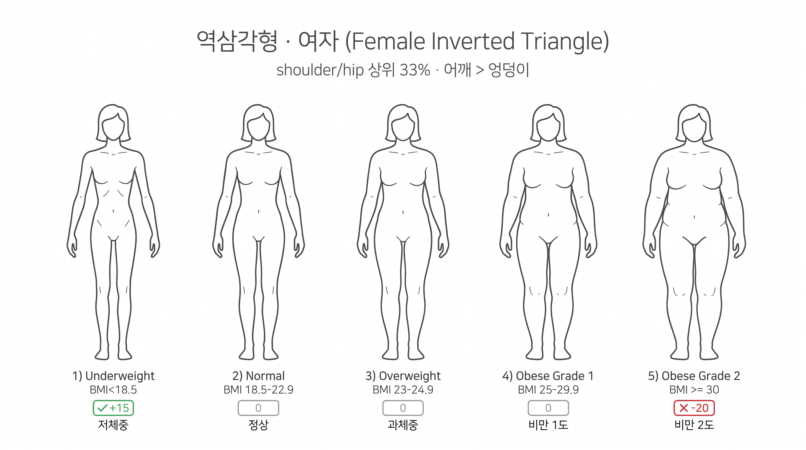

**남자 역삼각형 · BMI 5구간 비교**

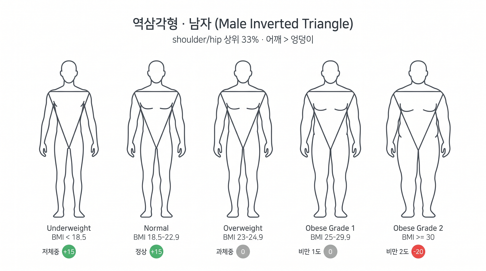

> **BMI 5구간 기준 (WHO 아시아-태평양, 2000)**
> - < 18.5: 저체중
> - 18.5–22.9: 정상
> - 23–24.9: 과체중
> - 25–29.9: 비만 1단계
> - ≥ 30: 비만 2단계

### 가로축 5체형 분류 알고리즘 (정의 그 자체)

```
1. waist/hip ≥ p67 (성별 내)        → 라운드형
2. shoulder/hip ≥ p67 (성별 내)     → 역삼각형
3. shoulder/hip ≤ p33 (성별 내)     → 삼각형
4. waist/hip ≤ p33 (성별 내)        → 모래시계형
5. 그 외                              → 직사각형
```

**허리를 먼저 보는 이유**: 허리가 엉덩이 대비 두꺼우면 어깨 폭과 무관하게 스타일링 과제가 "폭 균형"이 아니라 "허리 라인 분산"으로 바뀐다. 이 경우 어깨 기반 처방은 효과가 없다.

---

## 2. 세로축 — 1차원 비율 3종 (현재 입력 없음, 기본값 `balanced`)

다리·목·실루엣 인상에 영향을 주는 1차원 비율이 3개 있다. 셋은 서로 독립이며, 같은 §1 가로축 체형에서도 비율 조합에 따라 처방이 달라진다. 입력값이 없으면 모두 `balanced`로 두고 §1 가로축 규칙만 적용한다.

### 2.1 상체:하체 비율 (`torso_ratio`)

| 비율 | 신호 | 상의 (기장) | 하의 (밑위) | 스타일링 | 핵심 원리 |
| --- | --- | --- | --- | --- | --- |
| **상체 김** (다리 짧음) | `torso_ratio` > 기준 | 크롭·기본 / **롱 ✕** | **하이웨스트** / 로우 ✕ | 프론트 턱인, 벨트 최상단, 하의·신발 색 통일 | 허리선 ↑ → 다리 시작점 ↑ |
| **균형** | — | (가로축 규칙만) | (가로축 규칙만) | — | 모르면 `balanced`로 두는 게 안전 |
| **상체 짧음** (다리 김) | `torso_ratio` < 기준 | 기본·롱 / **크롭 ✕** | 레귤러·로우 / **하이웨스트 ✕** | 상의 빼입기, 롱 아우터 | long_torso 처방의 정반대 |

### 2.2 목 길이 (`neck_length`)

> 목 길이가 길수록 목폴라·터틀넥·하이넥 같은 높은 넥라인을 답답함 없이 소화할 수 있다. 짧은 목은 V넥·U넥·민소매로 시각적 길이를 보완한다.

| 비율 | 신호 | 상의 (넥라인) | 스타일링 | 핵심 원리 |
| --- | --- | --- | --- | --- |
| **긴 목** | `neck_length` > 기준 | 하이넥·목폴라·터틀넥 OK | 높은 넥라인 + 단독 착용 OK | 목 노출 줄여도 답답하지 않음 |
| **균형** | — | 무난 (모든 넥라인 OK) | — | 모르면 `balanced`로 두는 게 안전 |
| **짧은 목** | `neck_length` < 기준 | V넥·U넥·오픈카라·민소매 / **하이넥 ✕** | 깊은 V넥, 민소매, 셔츠 상단 1단 오픈 | 목 노출 ↑ → 시각적 길이 보완 |

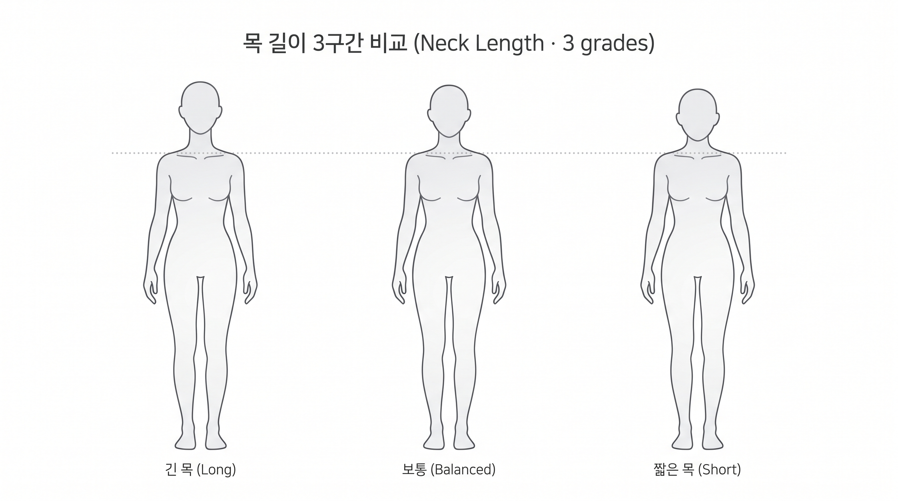

### 2.3 허벅지:종아리 비율 (`thigh_calf_ratio`)

> 허벅지가 종아리보다 길면, 전체 다리 길이가 같아도 다리가 짧아 보인다 (무릎이 위로 올라가 시각적 다리 분절이 짧아짐). 반대로 종아리가 길면 다리가 길어 보인다. 이건 §2.1 `torso_ratio`와 별개의 차원이라 둘 다 따로 측정해야 정확한 처방이 가능하다.

| 비율 | 신호 | 하의 (실루엣) | 신발/스타일링 | 핵심 원리 |
| --- | --- | --- | --- | --- |
| **허벅지 김** (thigh-dominant) | `thigh / knee-to-ankle` > 기준 | 와이드·부츠컷 / **슬림 ✕** | 하이웨스트 + 위쪽 분산 (벨트·셔츠 인) / 넓은 부츠·미들 부츠 | 무릎 위쪽 분산, 다리 시작점 시각적 ↑ |
| **균형** | — | 무난 (모두 OK) | — | 모르면 `balanced`로 두는 게 안전 |
| **종아리 김** (calf-dominant) | `thigh / knee-to-ankle` < 기준 | 슬림·스트레이트 / **와이드 ✕** | 하이웨스트 + 아래쪽 분산 / 슬림 부츠·앵클부츠 | 무릎 아래 분산, 다리 끝점 시각적 ↑ |

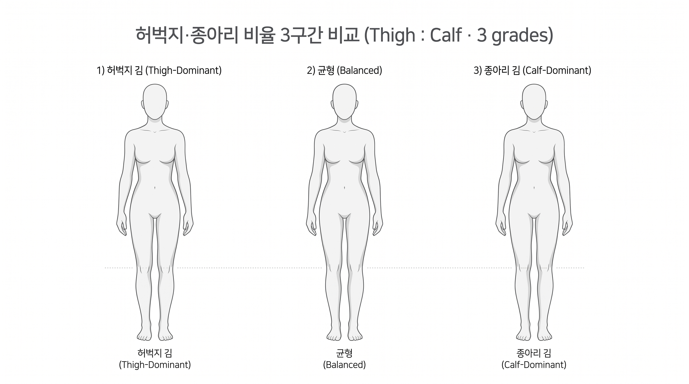

### 세로축 정의를 못 쓰는 이유 (blocker)

- **필요 입력**: 다리길이 / 앉은키 (`torso_ratio`), 목 길이 (`neck_length`), 허벅지:종아리 길이 (`thigh_calf_ratio`)
- **현재 상태**: `BodyMeasurement`에 컬럼 없음, pose 파이프라인 없음
- **해결**: taxonomy에 `rise`(torso_ratio), `neck_length`, `thigh_calf_ratio` 필드 추가 필요 (3곳 동기화 — `image-processor/pipeline/taxonomy.py`, `api/apps/wardrobe/taxonomy.py`, `test/test-llm2/common/taxonomy.py`)

**그래서 지금은 모두 `balanced`로 두고 세로축 규칙을 적용하지 않는 것이 안전하다.** 비율을 모른 채 "크롭+하이웨스트"를 일괄 추천하면 상체가 짧은 사용자에게는 상체를 더 짧게 만드는 정반대 처방이 나간다. 마찬가지로 짧은 목 사용자에게 목폴라를 일괄 추천하면 답답한 인상을 강조하는 정반대 처방이, 허벅지 김 사용자에게 슬림핏을 추천하면 무릎 위로 분산이 사라져 다리가 더 짧아 보이는 정반대 처방이 나간다.

---

## 3. 조합 규칙 예시 (기피)

| #  | 규칙                                           | 사유                                                   |
| -- | ---------------------------------------------- | ------------------------------------------------------ |
| C1 | **모래시계 + 오버핏 상의 + 와이드 하의** | 상하 동시 볼륨은 모래시계의 유일한 강점(허리)을 지운다 |
| C2 | **라운드 + 크롭 기장**                   | 가로 분할이 라운드형의 가로 폭을 강조                  |
| C3 | **라운드 + 슬림 또는 오버핏**            | 둘 다 라운드형의 가로 폭을 부각                        |
| C4 | **라운드 + 체크·도트 패턴**             | 가로 분할 효과                                         |
| C5 | **직사각 + 단일 색 + 긴 아우터 X**       | 상하 명도차 없으면 허리선이 안 생긴다                  |
| C6 | **짧은 목 + 하이넥·목폴라·터틀넥**         | 목 노출이 더 줄고 답답한 인상 강화                     |
| C7 | **허벅지 김 + 슬림핏 하의**                  | 무릎 위로 분산 사라져 다리가 더 짧아 보임              |
| C8 | **종아리 김 + 와이드 하의**                  | 무릎 아래로 분산 사라져 다리 끝점 강조 실패            |

---

## 4. 최종 권장 합성 규칙 (4차원)

> **축들은 모두 독립이다.** §1 가로축 1차원(체형 5종) × §2 세로축 3차원(torso_ratio / neck_length / thigh_calf_ratio) = **총 4차원**.
> 같은 역삼각형이라도 상체가 길면 크롭 상의, 짧으면 롱 상의. 여기에 짧은 목이면 V넥이 추가되고, 허벅지 김이면 와이드 하의가 추가된다.
> 최종 권장은 4차원 권장을 **교집합**으로 합치고, 어느 한 차원이라도 기피면 **기피**로 처리한다.

```
recommend = width_recommend
          ∩ torso_recommend
          ∩ neck_recommend
          ∩ thigh_calf_recommend

forbidden = width_forbidden
          ∪ torso_forbidden
          ∪ neck_forbidden
          ∪ thigh_calf_forbidden
```

---
---

## 6. 체형별 추천 카드 (4차원 처방 시각화)

> §1 가로축 체형 × BMI 5구간은 **이미지**로 표현하고, §2.1~2.3 세로축 3종
> (`torso_ratio` / `neck_length` / `thigh_calf_ratio`)의 분기는 **md 텍스트**로 분리한다.
> 분기 시에는 §2를 참조한다.

### 6.1 Phase 1 Pilot — 여자 역삼각형


**구성**:
- **5 BMI 미니 실루엣** (저체중 / 정상 / 과체중 / 비만 1단계 / 비만 2단계) — 어깨 > 엉덩이 비율은 5장 모두 유지하고, 전신 부피만 증가
- **가중치**: `+15`(◎ 권장), `0`(○ 허용), `-20`(△ 주의), `-30`(✕ 기피)
- **분기는 §2.1~2.3 참조** (md 텍스트로 분리)

**사용법**:
1. 좌측 5 BMI 미니 실루엣 중 **본인 BMI**에 해당하는 실루엣 확인
2. §2.1~2.3 분기표에서 **세로축 비율** 3개 체크
3. 두 축의 권장은 교집합(`∩`)으로 합치고, 어느 한쪽이라도 기피면 기피로 처리 (§4 수식)
4. 결과 코드를 `recommend` / `forbidden` 으로 분리하여 RAG 후보군에 가중치 적용

### 6.2 Phase 2 — 5체형 × 2성별 BMI 5구간 차트 (10장)

> §6.1 양식을 5체형 × 2성별 = 10개 세트로 확장. 분기는 §2.1~2.3을 공통 참조.

| 체형 | 여자 (Female) | 남자 (Male) | 비율 신호 |
| --- | :---: | :---: | --- |
| **역삼각형** |  |  | `shoulder/hip` 상위 33% |
| **삼각형** (하체 발달) | 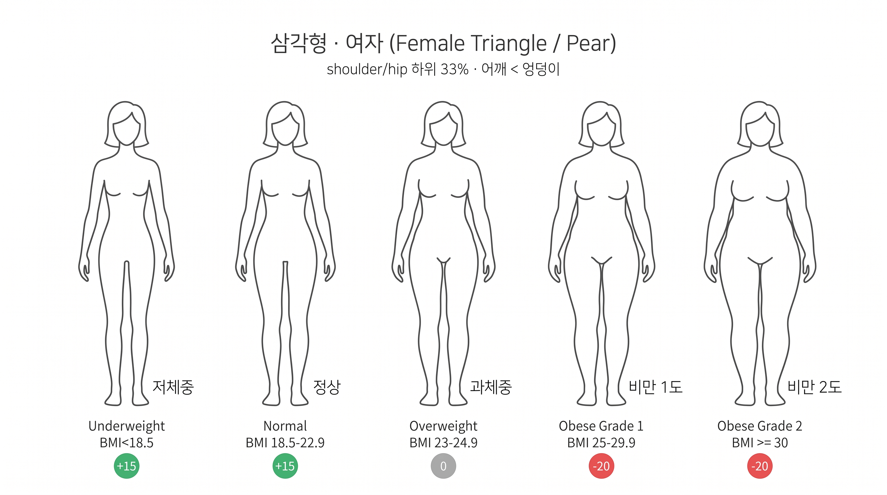 | 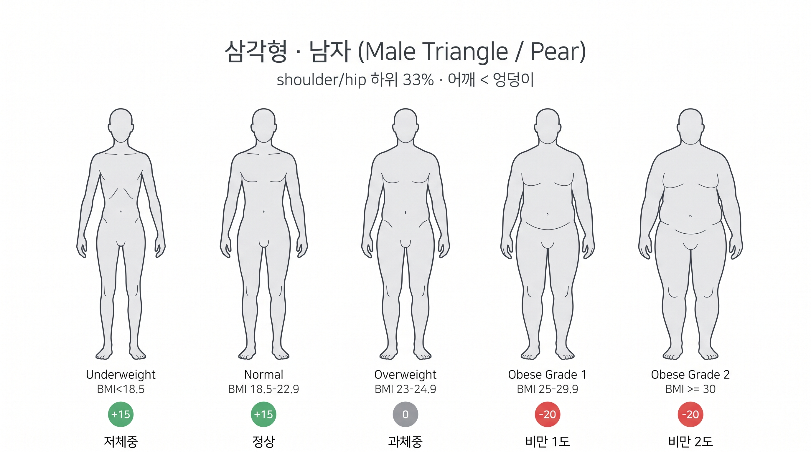 | `shoulder/hip` 하위 33% |
| **모래시계형** | 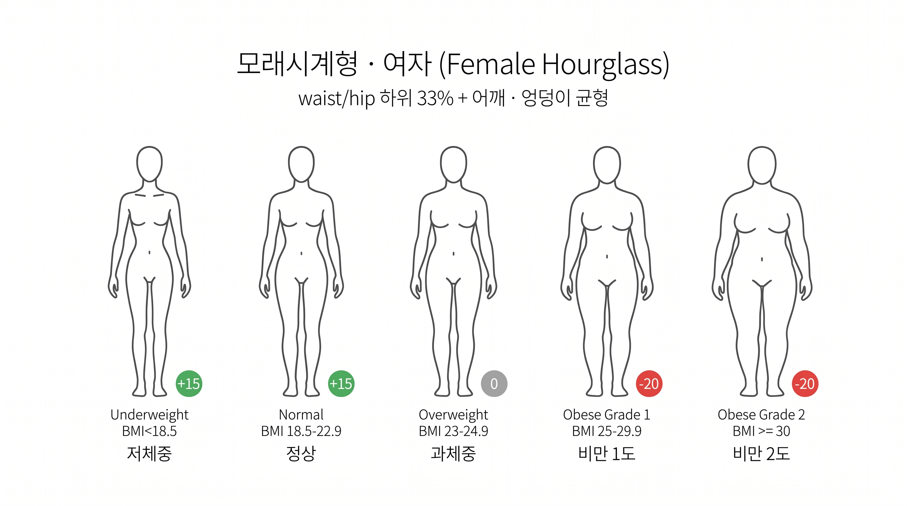 | 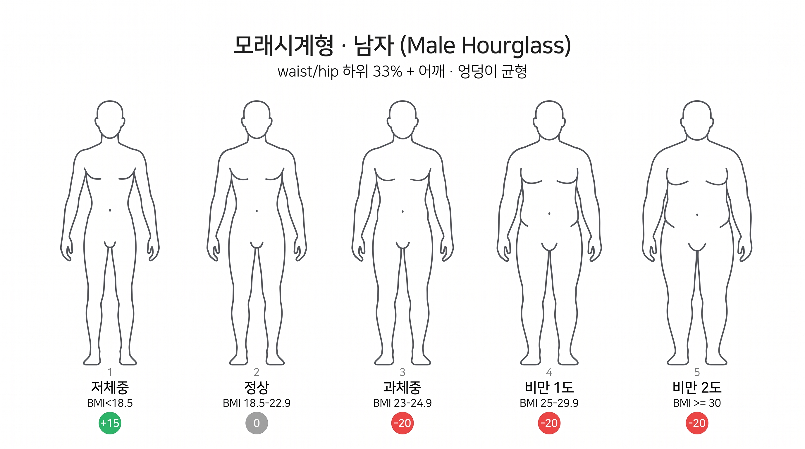 | `waist/hip` 하위 33% + 어깨 · 엉덩이 균형 |
| **직사각형** | 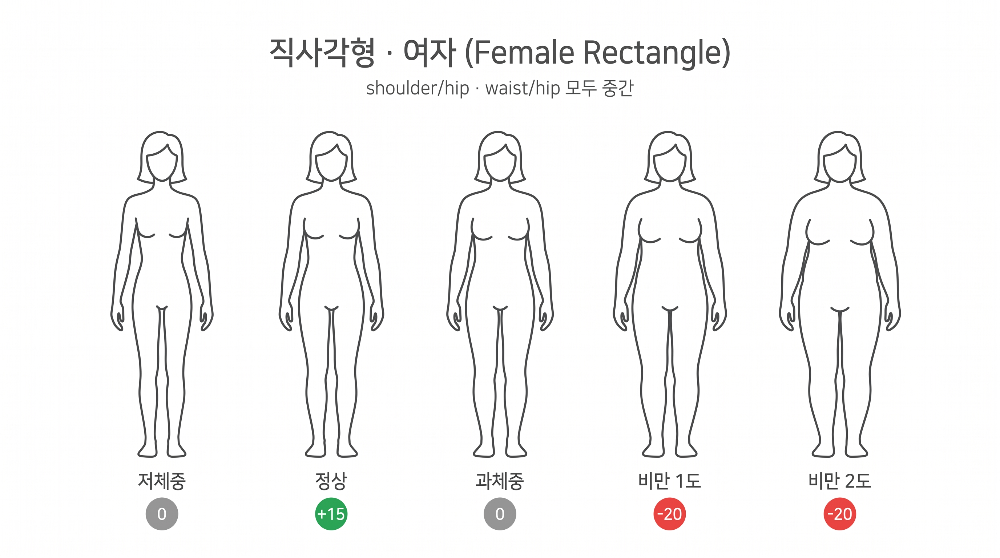 | 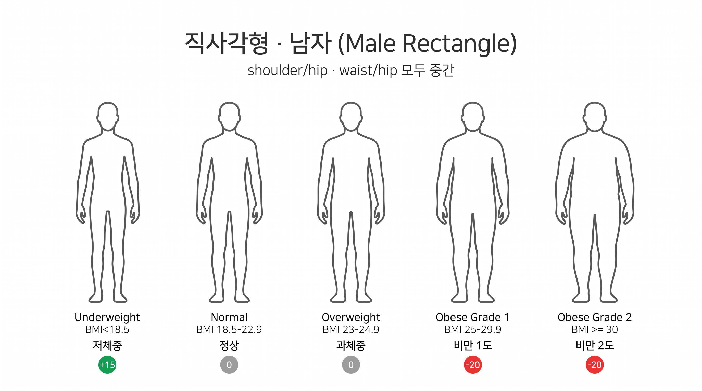 | `shoulder/hip` · `waist/hip` 모두 중간 |
| **라운드형** | 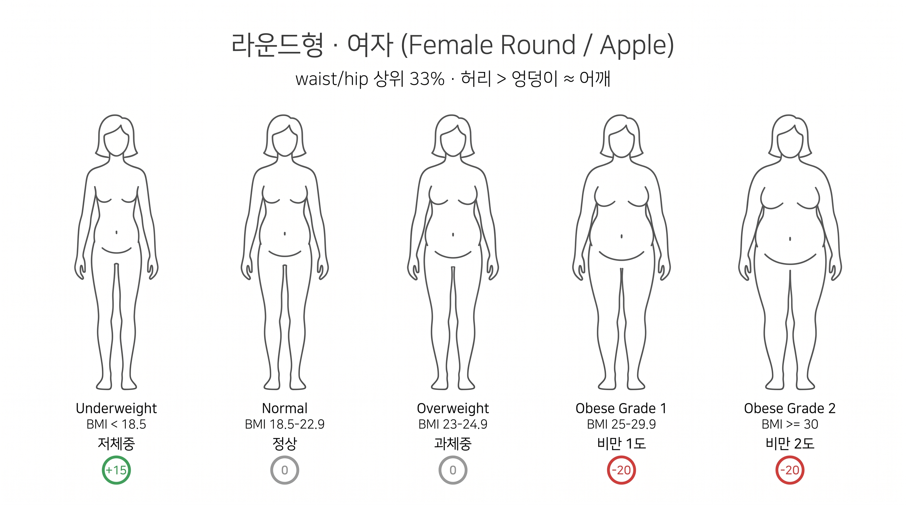 | 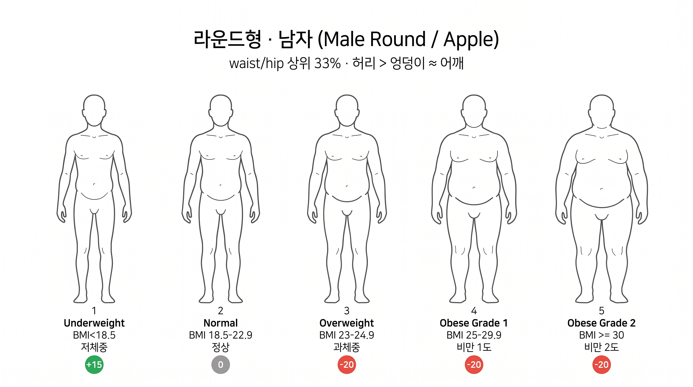 | `waist/hip` 상위 33% |

### 6.3 Phase 2b — 3대 세로비율 3구간 차트 (3장)

> §2.1~2.3 각 차원의 3구간 비교 차트. 이미 만든 `neck-length-3`, `thigh-calf-ratio-3` + 신규 `torso-ratio-3`.

| 차원 | 3구간 비교 차트 | 처방 |
| --- | :---: | --- |
| **`torso_ratio`** (상체:하체) | 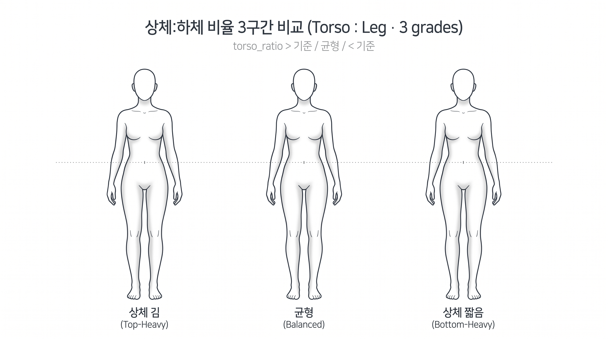 | §2.1 표 참조 (상의 기장 / 하의 밑위) |
| **`neck_length`** (목 길이) |  | §2.2 표 참조 (상의 넥라인) |
| **`thigh_calf_ratio`** (허벅지:종아리) |  | §2.3 표 참조 (하의 실루엣 / 신발) |

### 6.3b Phase 2c — 3대 세로비율 × 3구간 × 체형(BMI 5구간 미니 실루엣) — 9장

> §6.1~6.3??**"왼쪽처럼(BMI 5구간 미니 실루엣)"** 양식을 3대 세로비율 차원에도 적용. **체형 한정(역삼각형) × 3대 비율 × 3구간 = 9장**, 각 장은 5 BMI 미니 (모두 같은 체형·같은 비율 구간, BMI만 다름).
>
> **일관된 그림체**: 모든 실루엣에 동일한 디테일 — 머리카락(여자=어깨 길이), 얼굴(eyes/nose/mouth), 목, 어깨, 가슴, 허리, 엉덩이, 손(손가락), 발(발가락). 동일 선 굵기·음영·머리·몸 비율.

#### `torso_ratio` × 3구간 (역삼각형 · 여자 · BMI 5구간)

| 구간 | 일러스트 | 비율 신호 |
| --- | :---: | --- |
| **상체 김** (Top-Heavy) | 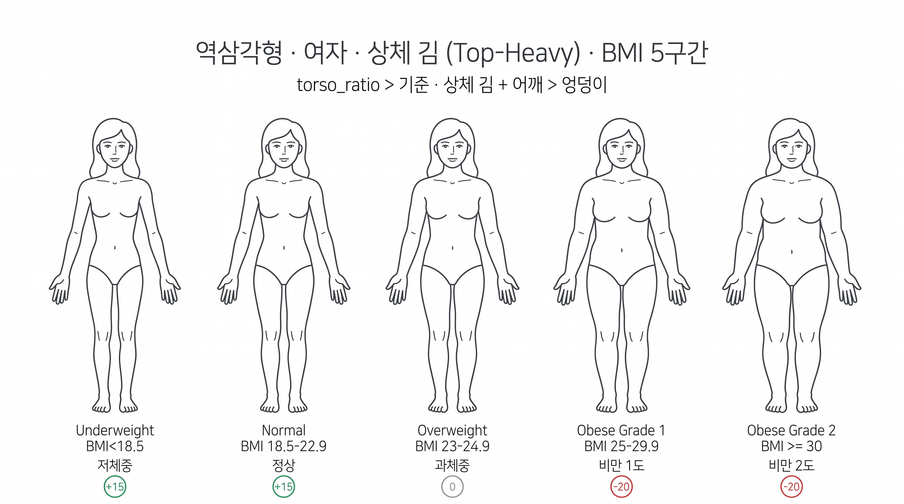 | `torso_ratio` > 기준 (긴 torso, 짧은 다리) |
| **균형** (Balanced) | 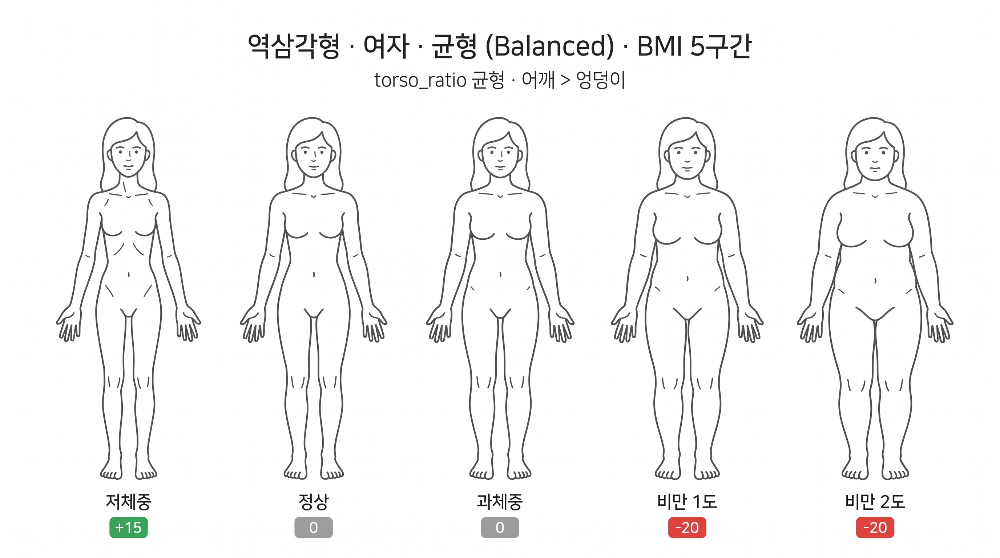 | `torso_ratio` 균형 |
| **상체 짧음** (Bottom-Heavy) | 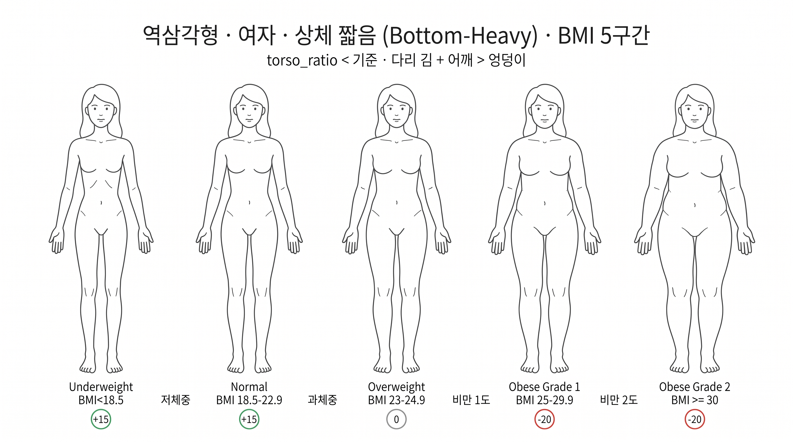 | `torso_ratio` < 기준 (짧은 torso, 긴 다리) |

#### `neck_length` × 3구간 (역삼각형 · 여자 · BMI 5구간)

| 구간 | 일러스트 | 비율 신호 |
| --- | :---: | --- |
| **긴 목** (Long) | 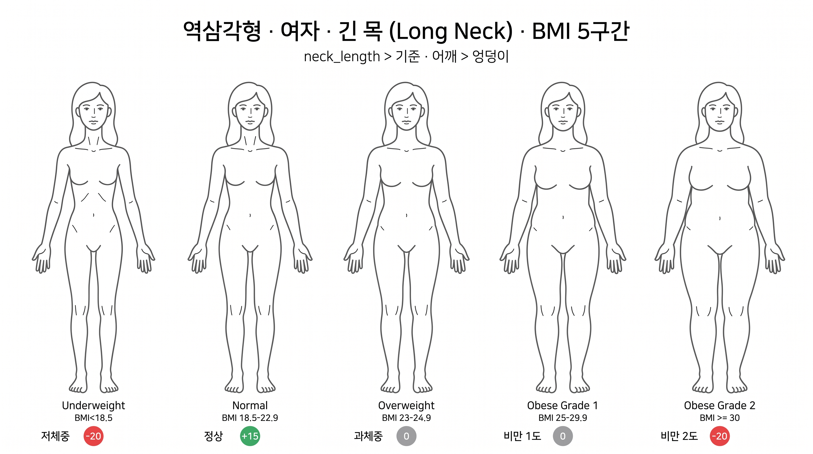 | `neck_length` > 기준 |
| **균형** (Balanced) | 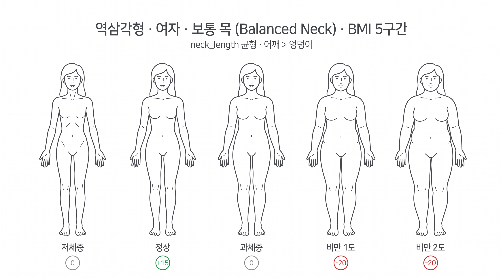 | `neck_length` 균형 |
| **짧은 목** (Short) | 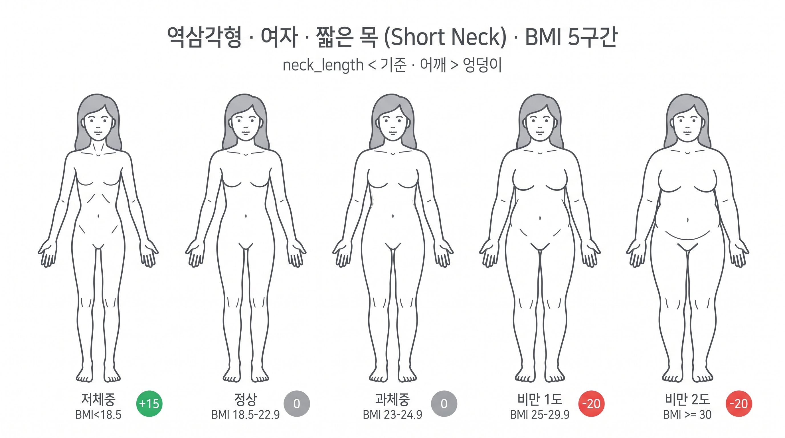 | `neck_length` < 기준 |

#### `thigh_calf_ratio` × 3구간 (역삼각형 · 여자 · BMI 5구간)

| 구간 | 일러스트 | 비율 신호 |
| --- | :---: | --- |
| **허벅지 김** (Thigh-Dominant) | 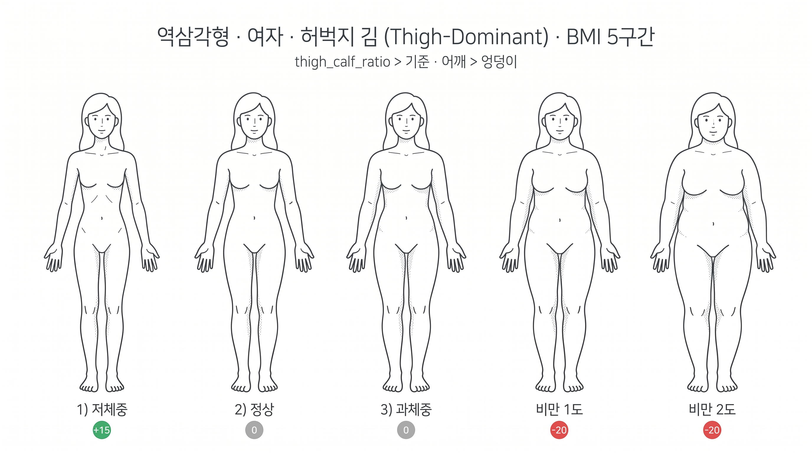 | `thigh_calf_ratio` > 기준 (무릎 위로 분산) |
| **균형** (Balanced) | 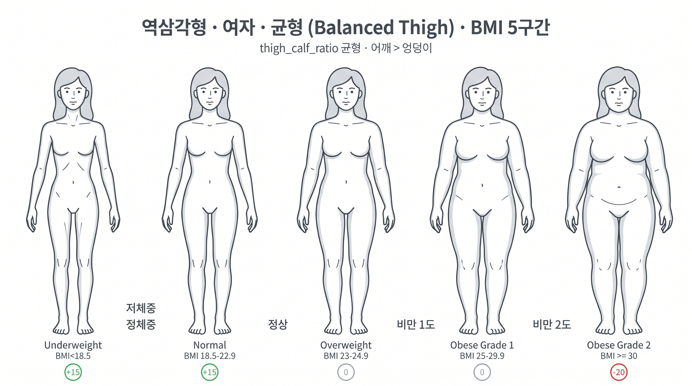 | `thigh_calf_ratio` 균형 |
| **종아리 김** (Calf-Dominant) | 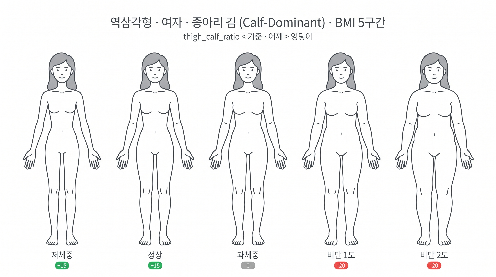 | `thigh_calf_ratio` < 기준 (무릎 아래 분산) |

> **Phase 2c (현재)**: 9장 — 역삼각형 여자 한정 (1체형 × 1성별). 그림체 일관성 확인용.
> **Phase 2c-확장 (예정)**: × 2성별 = 18장, × 5체형 = 90장 (점진적 확대 가능).

---

---

## 7. 사용처 (Craft §4 기준)

> 골든셋의 4차원 매트릭스 + 체형별 추천 카드는 다음 3가지로 사용된다.
> (출처: Craft 문서 `recommendation-golden-set-guide.md` §4)

### 7.1 Scoring Engine (랭킹 가중치)

RAG(검색 리트리버) 엔진이 의류 후보군을 가져온 뒤, 골든셋 규칙을 기반으로 가중치 점수를 매긴다.

- **예시 — 여자 역삼각형 + 정상 BMI + 상체 김**:
  - 상의: 오버핏 티셔츠 `-20` / 슬림핏 티셔츠 `+15` / 크롭 티셔츠 `+10`
  - 하의: 와이드 슬랙스 `+10` / 하이웨스트 슬랙스 `+10` / 스키니 `-30`
  - **최종 점수 = 가로축 + 세로축 3종 + BMI 보정**

> ⚠️ 색은 이 점수에 들어가지 않는다. 색 가중치는 `color/rules/color_rules.json`이
> 독립적으로 산출한다 (체형 축 ↔ 색 축 분리, §0 참조).

### 7.2 AI Explanation (자연어 근거 생성)

추천 결과를 사용자에게 보여줄 때, AI가 골든셋 규칙을 근거로 자연어 설명을 생성한다.

- **출력 예시**:
  - *"회원님의 어깨 너비 대비 엉덩이 비율이 좁은 편이라, 하체에 여유로운 실루엣을 더해주는
    와이드 슬랙스를 매치하여 전체적인 가로폭 균형을 맞췄어요."*

### 7.3 Unit Test (자동 QA)

추천 알고리즘이 특정 사용자 입력에 대해 정반대 추천을 하면, 골든셋 매트릭스와 대조하여 자동 채점한다.

- **예시**:
  - 알고리즘이 **라운드형 + 크롭티**를 추천 → §3의 C2 위반 → "골든셋 실루엣 규칙 위반(오답)" 처리
  - 알고리즘이 **짧은 목 + 터틀넥**을 추천 → §2.2 위반 → 오답 처리

---

## 8. 근거 / 출처

| 파일 | 내용 |
| --- | --- |
| `body/rules/body_fit_rules.json` | 수기 규칙 (위 표의 원천). v0.3.0부터 색 처방 없음 |
| `body/rules/body_shape_thresholds.json` | 181명 SizeKorea 실측 임계값 (p33/p67) |
| `golden-set/body/docs/02-body-proportion-rules.md` | 본문 (상세 설명, 알고리즘, 사례) |
| `golden-set/docs/recommendation-golden-set-guide.md` | 골든셋 아키텍처 + 사용처 (Scoring / Explanation / Unit Test) |

> **색 관련 문서는 여기 없다.** 체형 축은 색을 처방하지 않으므로
> `color/rules/color_rules.json`을 참조할 일이 없다 — 두 축은 독립이다.

_작성: 2026-08-06 / body_fit_rules.json v0.3.0_
