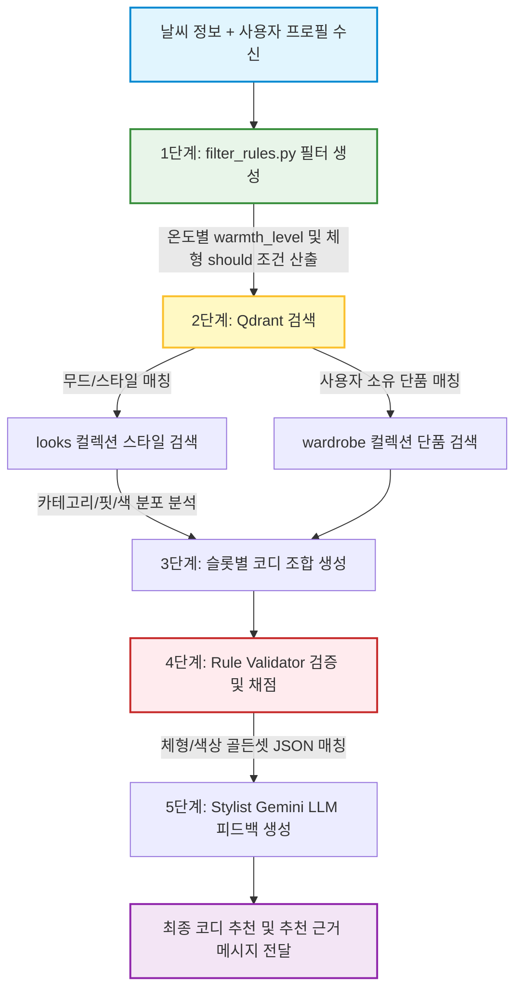

# [설계안] 오늘의 룩(Today's Look) 추천 아키텍처 및 기술적 근거

- **작성일**: 2026-08-06
- **문서 성격**: 추천 엔진 설계안 및 개발/ML 파트 설득용 기술 가이드
- **작성 대상**: RAG 기반 옷장 추천 엔진 및 골든셋 결합 아키텍처

---

## 1. 개요 및 추천 아키텍처 흐름

사용자에게 실측 사이즈 기반 체형 분석과 날씨에 맞는 최적의 코디를 추천하기 위해, 데이터베이스 필터링의 기계적 속도와 LLM(Gemini)의 유연성을 결합한 **하이브리드 RAG & 룰 필터링 아키텍처**를 채택합니다.

---

## 2. Django 프로젝트 내 구현 구조

추천 서비스 로직은 `api/apps/recommend` 모듈 내에서 다음과 같이 책임을 나누어 구현합니다.

| 모듈 및 파일 경로 | 주요 역할 | 주요 메서드 및 인터페이스 |
|---|---|---|
| **`services/filter_rules.py`** | 입력 정보(날씨, 프로필)를 기반으로 정적 필터 생성 | `build_weather_filter(temp) -> dict` `build_body_filter(body_type) -> dict` |
| **`services/qdrant.py`** | Qdrant 벡터 DB와의 통신 및 슬롯별 단품 검색 | `search_similar_looks(style) -> list` `search_wardrobe_items(user_id) -> list` |
| **`services/validator.py`** | 후보군 조합 생성 및 골든셋 규칙 기반 채점/검증 | `generate_combinations() -> list` `validate_and_score(combination) -> float` |
| **`services/gemini.py`** | 최종 후보 코디 설명글 및 피드백 자연어 생성 | `generate_styling_explanation(combination) -> str` |

---

## 3. 설계의 기술적 근거 (Rationale)

### 1) 개인 옷장 데이터의 소규모 특성에 부합 (Filtering > Vector Search)
* **근거:** 쇼핑몰 상품 검색과 달리, 개인 옷장의 아이템 수는 보통 수십 개에서 많아야 수백 개 수준입니다.
* **이유:** 수십만 개의 데이터 중에서 유사 벡터를 찾는 방식은 옷장 추천에 적합하지 않습니다. 대신 **하드 필터(기온/기피색)로 후보군을 안전하게 거르고, 남은 작은 풀에서 최선의 "조합"을 골든셋 매트릭스로 채점하는 방식**이 계산 비용과 정확도 측면에서 압도적으로 유리합니다. (인메모리 조합 연산 가능)

### 2) 이중 원천 방지 원칙 (Single Source of Truth)
* **근거:** 날씨나 체형에 따른 추천 제약을 LLM의 자유로운 프롬프트 판단에만 맡기면 일관성이 깨집니다. (한겨울에 반팔 추천 등)
* **이유:** 기온별 보온 수준(`warmth_level`), 체형별 기피 핏(크롭 기피 등)은 **`filter_rules.py`와 골든셋 JSON 파일에 정량적 상수로 고정**하고, LLM(Gemini)은 최종 조합에 대한 **설명글 작성(Reasoning & Styling explanation)** 역할만 담당하게 분리해야 서비스의 안전성이 보장됩니다.

### 3) 체형 분류와 비율의 독립성 보장
* **근거:** `02-body-proportion-rules.md` 설계에 따르면 가로축(사이즈코리아 6체형)과 세로축(상하체, 목길이 등 3비율)은 상호 독립입니다.
* **이유:** 단순히 "역삼각형"이라는 체형 정보 하나만으로 옷을 일괄 추천하면 상체가 짧은 사람에게 상체를 더 짧게 만드는 오판이 일어납니다. 따라서 룰 검증기(`validator.py`)가 가로축 규칙과 세로축 규칙을 개별 계산한 뒤 **교집합(`∩`) 연산**을 수행하도록 설계해야 정교한 개인화가 가능합니다.

### 4) 데이터 기반의 검증 및 평가(QA) 자동화 용이성
* **근거:** 시스템이 뱉은 최종 결과의 품질을 평가할 때 사람이 매번 개입하는 것은 비효율적입니다.
* **이유:** 추천 로직이 규칙 기반(JSON)으로 짜여 있으면, 테스트 코드(`tests.py`)를 통해 **"체형 기피 조건 위반율 = 0%"**, **"날씨 부적합 노출률 = 0%"** 등의 정량적 평가 지표를 빌드 파이프라인에서 자동으로 채점하고 상시 모니터링할 수 있습니다.
