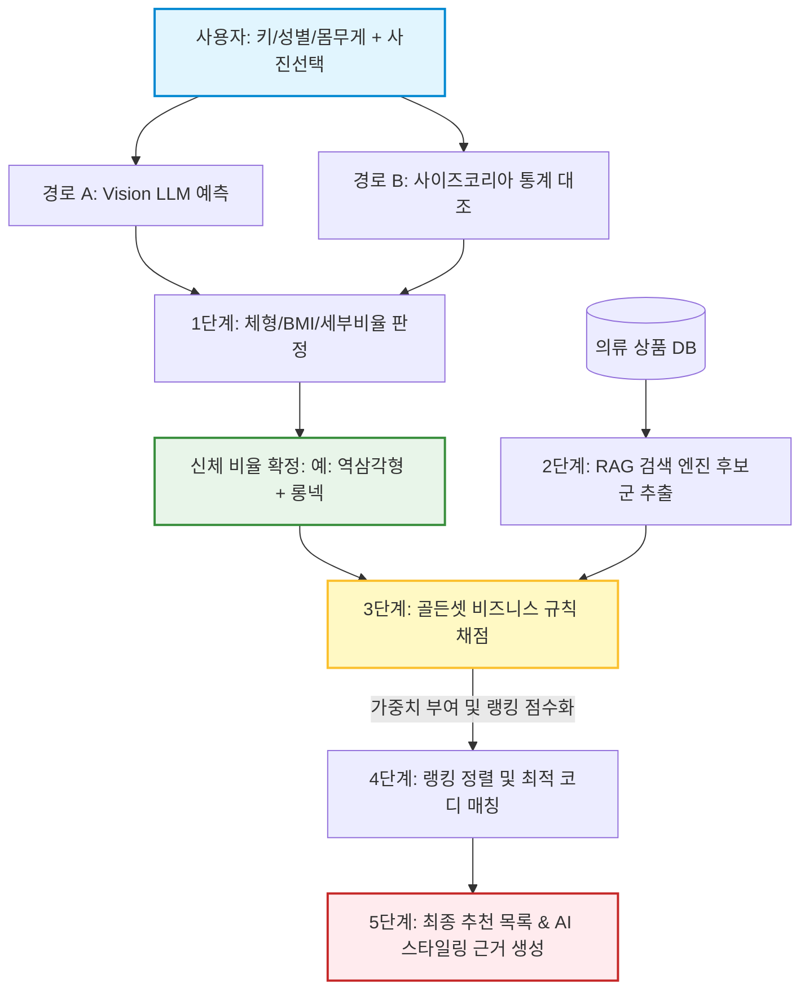

# [공유용] 추천 엔진 골든셋(Golden Set) 아키텍처 및 활용 시나리오 가이드

- **작성일**: 2026-08-06 (최종 업데이트)
- **문서 성격**: 추천 엔진 개발팀 및 기획팀 공유용 컨셉/아키텍처 가이드
- **작성 대상**: 체형/색상 매칭 규칙 기반 추천 알고리즘 설계 및 활용처

---

## 1. 개요: "왜 골든셋 규칙이 필요한가?"

사용자가 입력한 신체 실측 사이즈를 기반으로 단순히 체형을 분류하는 것에 그치지 않고, **실제 의류 추천 서비스에서 이를 어떻게 활용하고 어떤 가치를 만들어내는지** 팀원 및 이해관계자에게 설명하기 위해 작성된 가이드라인입니다.

우리가 구축한 골든셋(체형/색상 매칭 기준 규칙)은 완전히 개인화된 취향을 덮어쓰거나 완벽한 정답을 강제하는 것이 아닙니다. 대신, **"체형적 단점을 피하고 가장 균형 잡힌 코디 조합의 가중치를 계산하는 추천 시스템의 뼈대"** 역할을 수행합니다.

---

## 2. 사용자 입력 및 신체 사이즈 예측 경로 (2-Way Predictor)

사용자가 추천을 시작할 때 필수 신체 정보와 함께 사진 유무에 따라 시스템은 두 가지 경로로 신체 상세 비율을 산출합니다.

| 분류 | 필수 입력 정보 | 사진 첨부 여부 | 신체 사이즈 및 비율 예측 메커니즘 |
|---|---|---|---|
| **경로 A (사진 기반)** | 키, 성별, 몸무게 | **O (사진 첨부)** | **Vision LLM 분석**: 사용자의 전신 코디 사진에서 시각적 비율을 추출하여 어깨너비, 허리둘레, 엉덩이둘레 등 실측 사이즈를 직접 예측합니다. |
| **경로 B (통계 기반)** | 키, 성별, 몸무게 | **X (사진 없음)** | **평균 비율 연산**: 키, 성별, 몸무게를 기준으로 사이즈코리아(Size Korea) 인체 실측 통계 분포 데이터를 대조하여 가장 어울리는 표준 신체 비율을 추정합니다. |

---

## 3. 체형 및 신체 비율 판정 체계

산출된 예측 신체 사이즈를 바탕으로 추천 엔진은 다음 3가지 축을 동시에 판정하여 교집합(`∩`) 연산을 수행합니다.

1. **가로축 체형 판정 (5대 실루엣)**
   * 사이즈코리아(Rasband 1994) 상반신 체형 6종: 모래시계체형, 역삼각체형, 삼각체형(하체 발달형), 사각체형, 둥근체형(허리 발달형, 플러스사이즈 A/B 서브타입 포함), 표준체형(치우침 없음 — 처방 제약 없음)
   * 마름모꼴체형·튜브체형은 Rasband 8체형에 있으나 실측 배정률이 1퍼센트 미만이라 운영에서 제외한다
2. **체격 판정 (BMI 지수)**
   * 저체중, 표준, 과체중, 비만 분포 등 체적 가중치를 고려합니다.
3. **세로축 및 세부 비율 판정 (3대 세부 지표)**
   * **목길이 비율**: 카라 기장 및 넥라인(V넥, 하이넥 등) 필터에 개입.
   * **허벅지/종아리 비율**: 팬츠 핏(와이드 vs 스트레이트 vs 숏팬츠) 결정.
   * **상하체 비율**: 하이웨이스트 등 상하 기장 분할선 조절.

---

## 4. 추천 엔진의 구체적인 3대 서비스 활용처

### 1) 추천 엔진 필터링 및 랭킹 가중치 적용 (Scoring Engine)
RAG(검색/리트리버) 엔진이 상품 데이터베이스에서 의류 목록을 가져온 후, 골든셋의 규칙을 기반으로 최종 추천 목록의 순위(Ranking)를 계산합니다.
* **작동 예시:**
  * 사용자의 사이즈 데이터를 통해 **삼각형(하체 발달형)** 체형으로 계산된 경우:
    * **상의:** 오버핏 상의 (추천 가점 `+15점`), 슬림핏 상의 (기피 감점 `-20점`)
    * **하의:** 와이드핏 하의 (기피 감점 `-30점` - 하체 볼륨을 부각하므로 기피), 레귤러핏 하의 (추천 가점 `+10점`)
  * 이 연산을 거쳐 사용자의 체형적 강점을 극대화하는 아이템조합이 추천 최상단에 노출됩니다.

### 2) 개인화 스타일 피드백 자동 생성 (AI Explanation)
사용자에게 특정 코디 세트를 추천했을 때, AI가 이를 추천한 명확한 논리적 근거(Reasoning)를 자연어로 생성하여 사용자 신뢰도를 높입니다.
* **출력 예시:**
  * *"회원님의 어깨 폭 대비 엉덩이 비율을 고려했을 때, 상체에 여유로운 실루엣을 더해주는 오버핏 셔츠와 곧게 떨어지는 레귤러 슬랙스를 매치하여 전체적인 가로폭 균형을 맞춘 코디입니다."*

### 3) 추천 품질 자동 평가 및 QA 자동화 (Recommendation Unit Test)
새로 개발하거나 튜닝한 추천 알고리즘의 품질을 사람이 일일이 검수하지 않고, 골든셋 기준 데이터와 비교하여 자동으로 채점(Scoring)합니다.
* **작동 예시:**
  * 알고리즘이 **둥근체형(허리 발달형)** 체형인 사용자에게 **크롭티(가로선 분할 효과로 체형 단점 강조)**를 추천한 경우 ➔ **"골든셋 비즈니스 규칙 위반(오답)"** 처리하여 개발자에게 피드백 주고 품질 지표를 자동으로 관리합니다.

---

## 5. 추천 프로세스 데이터 흐름도 (Data Flow Diagram)

사용자의 입력에서부터 골든셋 규칙이 필터링 및 랭킹에 개입하여 최종 추천 결과로 이어지는 흐름은 다음과 같습니다.

---

## 6. 추천 시스템 아키텍처 논쟁 가이드: "Retriever vs Agent"

개발 회의 중 자주 등장하는 복잡한 시스템 아키텍처 용어(임베딩, 리트리버, 에이전트)에 대한 개념 정리와 우리 프로젝트의 해결 방식입니다.

### 1) 기술 용어 한눈에 이해하기
* **임베딩(Embedding)할 때 처리하자:**
  * **의미:** 상품 데이터베이스에 옷을 등록(임베딩)할 때, **옷 자체에 어울리는 체형 태그를 미리 박아두는 것**입니다. (도서관 책꽂이에 꽂기 전에 딱지를 붙여두는 작업)
* **리트리버(Retriever) 방식으로 처리하자:**
  * **의미:** 데이터베이스에서 옷을 검색해오는 단계에서 **체형에 맞지 않는 옷은 아예 검색조차 안 되도록 걸러내는(탈락요건 필터링) 것**입니다. (도서관 검색대 필터)
  * **Input:** 사용자 체형 (예: `역삼각형`)
  * **Output:** 체형 필터가 1차 적용된 **옷 후보군 리스트**
* **에이전트(Agent) 방식으로 처리하자:**
  * **의미:** 일단 검색된 옷 후보군들을 **AI 모델(LLM)에게 건네주고, AI가 직접 규칙 문서(골든셋)를 읽어가며 적합 여부를 능동적으로 판단하는 것**입니다. (개인 비서의 판단)
  * **Input:** 1차 검색된 옷 후보군 + 골든셋 규칙 텍스트
  * **Output:** AI가 최종 선정한 **최적 코디 조합 + 추천 논리 근거**

### 2) 아키텍처 결정 가이드 (하이브리드 권장안)
회의 시 논쟁을 해결하기 위해 제안하는 **하이브리드(통합) 아키텍처** 모델입니다.

1. **기피/탈락 요건 (Hard Filter) ➔ Retriever가 담당:**
   * 둥근체형에게 크롭티 추천 차단과 같은 절대적인 기피 규칙은 속도가 빠른 **Retriever(검색 단계)**에서 SQL 쿼리나 단순 태그 매칭으로 즉시 탈락시킵니다.
2. **추천/선호 가중치 및 컨텍스트 (Soft Filter) ➔ Agent가 담당:**
   * 걸러진 옷 후보군을 **Agent(AI 모델)**에 전달하여, "상하 명도 차이를 두어 허리선 만들기"와 같이 섬세하고 복잡한 조합 규칙을 계산하고, 사용자에게 보여줄 **친절한 스타일 피드백 설명문을 생성**합니다.

---

## 7. 팀원 설득을 위한 Q&A 가이드

#### Q1. "체형이나 색상에 완벽한 정답이 없는데 규칙으로 강제해도 되나요?"
* **A.** 강제하는 하드 필터(`must_not`)가 아니라, 어울릴 확률이 높은 아이템의 순위를 올려주는 **소프트 가중치(`should`)로만 작동**합니다. 따라서 사용자의 개성과 다양한 스타일이 유지되면서도 실패할 확률이 높은 극단적인 조합만 안전하게 걸러집니다.

#### Q2. "사용자 취향과 골든셋 규칙이 충돌하면 어떻게 되나요?"
* **A.** 명확한 우선순위를 따릅니다. 사용자의 선호/기피 설정(취향)이 1순위이며, 골든셋 규칙은 2순위입니다. 사용자가 '슬림핏'을 선호한다고 등록했다면 체형 규칙이 오버핏을 권장하더라도 사용자의 취향을 우선 반영합니다.

#### Q3. "실제 코드로 어떻게 구현되나요?"
* **A.** `golden-set/body/rules/body_fit_rules.json` 및 `color_rules.json` 파일이 시스템의 유일한 **판단 원천(Single Source of Truth)**이 됩니다. 개발 파트에서는 이 JSON 파일을 불러와 가중치 점수판(Score Board)으로 참조하는 필터링 클래스만 구현하면 됩니다.
