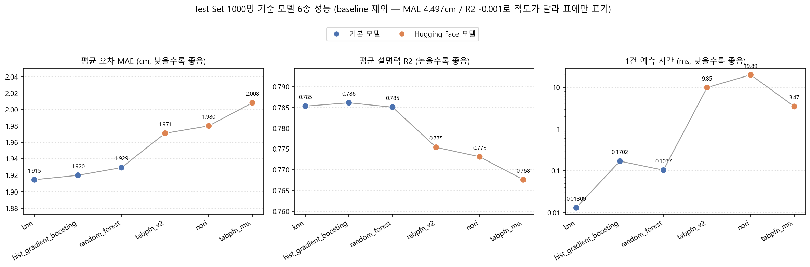
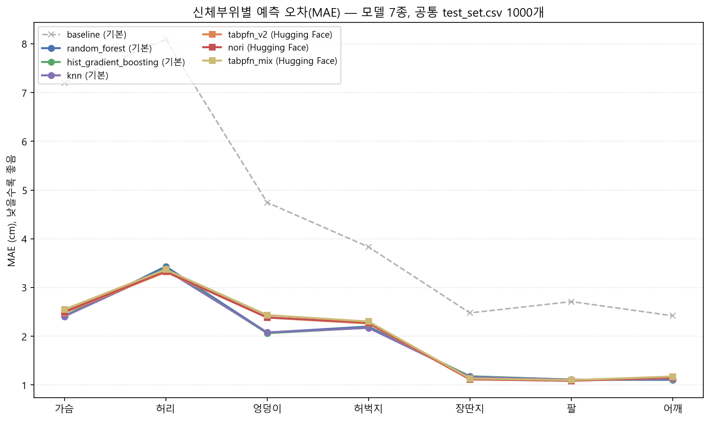
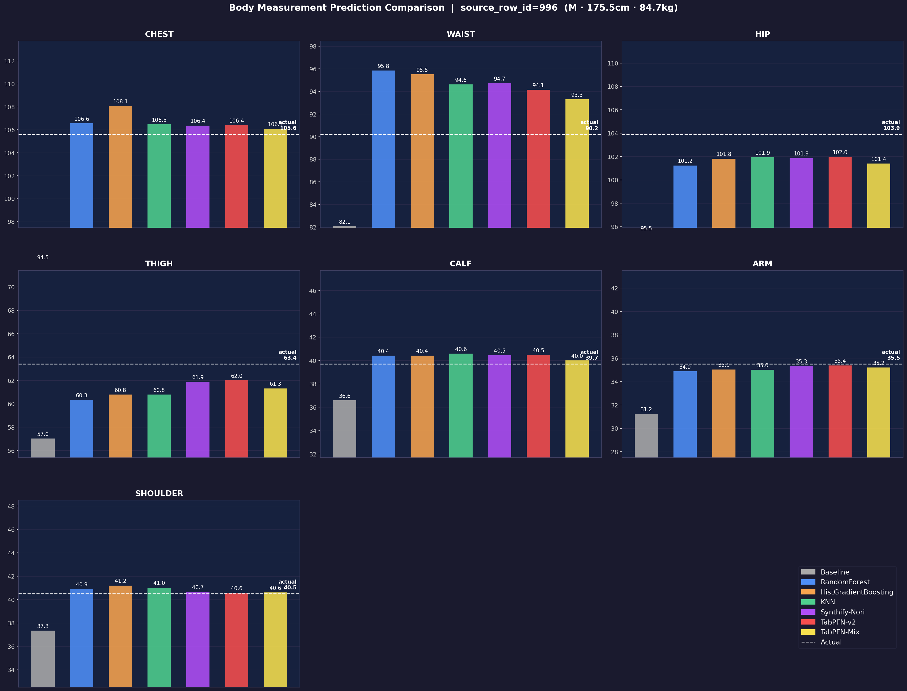
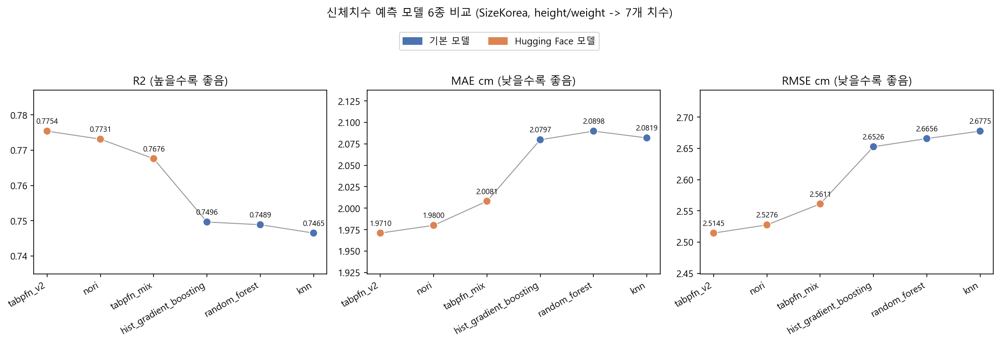

# 신체치수 예측 모델 비교 보고서

이 벤치마크는 **성별·키·몸무게 3개만 입력했을 때 의류 사이즈 추천에 필요한 신체치수 7개(가슴/허리/엉덩이/허벅지/장딴지/팔/어깨)를 얼마나 정확하게 예측할 수 있는지** 확인하기 위한 실험이다.

핵심은 "같은 시험지를 모든 모델에게 풀렸다"는 점이다. 기본 모델 4개와 Hugging Face 모델 3개, 총 7개가 **동일한 test set 1000명**을 예측했고, 그 예측 결과를 모델별 CSV로 남겼다.

- 데이터: SizeKorea 정제 CSV (`sizekorea_measurements_clean.csv`, 5,092행)
- 분할: 학습 4,092명 / **공통 test set 1,000명** (`random_state=42`, `test_set.csv`로 고정 저장)
- 입력(X): `gender`, `height`, `weight`
- 출력(y): `chest`, `waist`, `hip`, `thigh`, `calf`, `arm`, `shoulder`
- 기본 모델 4개는 로컬 CPU, HF 모델 3개는 Colab GPU에서 실행

## 1. 결과 — Test Set 1000명 예측 성능 (메인)

7개 모델이 같은 `test_set.csv` 1000명을 예측한 결과다. MAE 기준 오름차순 정렬.
(원본: `model_comparison_summary.csv`, `test_predictions_{model}.csv`)

시간은 실제 서비스에서 의미 있는 **1명(1행) 예측에 걸린 시간** 기준이다. 전체 학습 시간은 실행 환경(로컬 CPU vs Colab GPU)이 달라 직접 비교가 어렵고, 추천 API에서 사용자가 체감하는 것도 1건 응답 속도이기 때문이다.

| 순위 | 모델                   | 구분 |   mean_mae (cm) |  mean_rmse (cm) |         mean_r2 |    1건 예측(ms) |
| ---: | ---------------------- | ---- | --------------: | --------------: | --------------: | --------------: |
|    1 | knn                    | 기본 | **1.915** |           2.465 |           0.785 | **0.013** |
|    2 | hist_gradient_boosting | 기본 |           1.920 | **2.461** | **0.786** |           0.170 |
|    3 | random_forest          | 기본 |           1.929 |           2.469 |           0.785 |           0.104 |
|    4 | tabpfn_v2              | HF   |           1.971 |           2.515 |           0.775 |            9.85 |
|    5 | nori                   | HF   |           1.980 |           2.528 |           0.773 |           19.89 |
|    6 | tabpfn_mix             | HF   |           2.008 |           2.561 |           0.768 |            3.47 |
|    7 | baseline               | 기본 |           4.497 |           5.593 |          -0.001 |          0.0001 |



`mean_mae`가 1.915cm라는 것은, 이 모델이 예측한 7개 신체치수가 실제 측정값과 평균 약 1.9cm 차이났다는 뜻이다.
차트는 baseline을 뺀 6개 모델만 그렸다. baseline은 오차가 2배 이상 커서 함께 그리면 나머지 6개가 한 줄로 눌려 구분되지 않기 때문이다.

**결론**

1. **baseline을 제외한 6개 모델은 사실상 동급이다.** MAE 1.9152.008cm, R² 0.7680.786으로 전체 폭이 0.09cm·0.018에 불과하다.
2. **기본 모델 3개(knn/hist_gradient_boosting/random_forest)가 오히려 근소하게 앞선다.** 상위 3위를 기본 모델이 차지했고, HF 모델 3개가 4~6위다.
3. **1건 예측 속도 차이가 정확도 차이보다 훨씬 크다.** knn 0.013ms vs nori 19.89ms로 약 1,500배 차이다. 정확도는 0.07cm(약 3퍼센트) 차이인데 응답 속도는 세 자릿수 배율로 벌어진다. 차트에서도 MAE·R² 선은 거의 평평한 반면, 예측 시간 선만 로그 축에서 급격히 꺾인다.
4. **baseline(평균만 찍는 더미 모델)은 R²가 -0.001로 사실상 0이다.** 나머지 6개 모델이 입력값을 실제로 학습해 예측하고 있다는 근거다. baseline 대비 오차를 절반 이하(4.50cm → 1.92cm)로 줄였다.

## 2. 오차 분석 — 신체부위별

같은 예측 결과를 부위 단위로 쪼갠 MAE(cm)다. 굵게 표시한 값이 해당 부위 최저 오차.
(원본: `model_comparison_detail.csv`)

| 부위   | baseline |  random_forest | hist_gradient_boosting |            knn |      tabpfn_v2 |           nori | tabpfn_mix |
| ------ | -------: | -------------: | ---------------------: | -------------: | -------------: | -------------: | ---------: |
| 가슴   |     7.20 | **2.41** |                   2.42 |           2.41 |           2.48 |           2.50 |       2.55 |
| 허리   |     8.09 |           3.43 |                   3.39 |           3.36 | **3.32** |           3.33 |       3.37 |
| 엉덩이 |     4.74 |           2.08 |         **2.06** |           2.08 |           2.38 |           2.39 |       2.43 |
| 허벅지 |     3.83 |           2.20 |                   2.17 | **2.17** |           2.26 |           2.28 |       2.30 |
| 장딴지 |     2.48 |           1.17 |                   1.18 |           1.17 | **1.11** |           1.12 |       1.13 |
| 팔     |     2.71 |           1.11 |                   1.11 |           1.11 |           1.09 | **1.09** |       1.10 |
| 어깨   |     2.42 |           1.11 |         **1.10** |           1.11 |           1.15 |           1.16 |       1.17 |



**결론**

1. **오차 크기는 모델보다 신체부위가 결정한다.** 모든 모델이 공통적으로 허리(3.3~3.4cm)에서 가장 크고, 팔·어깨·장딴지(1.1cm대)에서 가장 작다. 허리는 같은 키·몸무게라도 개인차가 큰 부위이기 때문이다.
2. **부위별 1등은 갈린다.** 기본 모델이 가슴·엉덩이·허벅지·어깨에서, HF 모델이 허리·장딴지·팔에서 근소하게 앞선다. 특정 모델이 전 부위를 지배하지 않는다.
3. **다만 그 차이는 대부분 0.1~0.15cm다.** 부위별 1등을 가리는 것보다 "6개 모델이 전 부위에서 비슷하다"는 점이 실무적으로 더 중요하다.
4. **엉덩이 부위에서만 기본 모델이 뚜렷이 앞선다.** 기본 모델 2.06~2.08cm vs HF 2.38~2.43cm로 약 0.3cm 차이가 나, 다른 부위(0.1cm 내외)보다 격차가 크다.

## 3. 샘플 케이스 분석 — source_row_id 996 (남성 · 175.5cm · 84.7kg)

1000명 중 한 명을 골라 7개 모델이 각 신체 부위를 실제로 어떻게 예측했는지 구체적으로 확인한다.

### 3-1. 모델별 예측값 비교 차트

흰 점선이 실제 측정값(actual), 각 색상 막대가 모델별 예측값이다.



### 3-2. 예측값 + 오차 통합 표

`_pred`: 모델이 예측한 값(cm) / `_err`: 오차(예측 - 실제, 0에 가까울수록 정확)

(원본: `artifacts/csv/compare_996_combined.csv`)

| model                | chest_pred |       chest_err | waist_pred |       waist_err | hip_pred | hip_err | thigh_pred | thigh_err | calf_pred |        calf_err | arm_pred | arm_err | shoulder_pred |    shoulder_err |
| -------------------- | ---------: | --------------: | ---------: | --------------: | -------: | ------: | ---------: | --------: | --------: | --------------: | -------: | ------: | ------------: | --------------: |
| **actual**     |     105.60 |                 |      90.20 |                 |   103.90 |         |      63.40 |           |     39.70 |                 |    35.50 |         |         40.50 |                 |
| Baseline             |      94.49 |          -11.11 |      82.07 |           -8.13 |    95.47 |   -8.43 |      57.02 |     -6.38 |     36.59 |           -3.11 |    31.23 |   -4.27 |         37.34 |           -3.16 |
| RandomForest         |     106.56 |           +0.96 |      95.85 |           +5.65 |   101.24 |   -2.66 |      60.33 |     -3.07 |     40.42 |           +0.72 |    34.88 |   -0.62 |         40.90 |           +0.40 |
| HistGradientBoosting |     108.06 |           +2.46 |      95.50 |           +5.30 |   101.82 |   -2.08 |      60.79 |     -2.61 |     40.43 |           +0.73 |    35.04 |   -0.46 |         41.20 |           +0.70 |
| KNN                  |     106.47 |           +0.87 |      94.62 |           +4.42 |   101.94 |   -1.96 |      60.79 |     -2.61 |     40.59 |           +0.89 |    35.00 |   -0.50 |         41.03 |           +0.53 |
| Synthify-Nori        |     106.37 |           +0.77 |      94.72 |           +4.52 |   101.86 |   -2.04 |      61.89 |     -1.51 |     40.45 |           +0.75 |    35.33 |   -0.17 |         40.66 |           +0.16 |
| TabPFN-v2            |     106.40 |           +0.80 |      94.14 |           +3.94 |   101.97 |   -1.93 |      62.00 |     -1.40 |     40.47 |           +0.77 |    35.38 |   -0.12 |         40.59 |           +0.09 |
| TabPFN-Mix           |     106.08 | **+0.48** |      93.30 | **+3.10** |   101.40 |   -2.50 |      61.32 |     -2.08 |     40.00 | **+0.30** |    35.20 |   -0.30 |         40.60 | **+0.10** |

**관찰 포인트**

- **Baseline**은 모든 부위에서 `-3 ~ -11cm`로 크게 빗나가 — 평균만 찍는 더미 모델임이 확인된다.
- **waist**는 모든 모델이 실제(90.2cm)보다 높게 예측(+3~+5cm) — 개인 허리 편차가 큰 부위 특성이 반영된 결과다.
- **chest/hip/arm/shoulder**는 HF 모델(Synthify-Nori, TabPFN-v2, TabPFN-Mix)이 기본 모델보다 실제값에 근접했다.
- **thigh**는 기본 모델 3개가 -3cm 내외, HF 모델이 -1.4~-2cm로 HF 쪽이 더 정확하다.

## 4. Test Set 구성과 컬럼

### 4-1. Test Set 구성

- 공통 시험지는 `test_set.csv` **1개, 1000명**이다. 7개 모델 전부 이 동일한 1000명으로 평가됐다.
- 성별 분포: 여성 553명, 남성 447명.
- 각 행은 `source_row_id`로 SizeKorea 원본 데이터의 몇 번째 행인지 추적할 수 있다.
- HF 3개 모델(Colab 실행)도 `--test-data test_set.csv` 옵션으로 이 1000명을 그대로 받아썼다. 무작위로 다시 나눈 별도 test set이 아니므로 기본 모델과 100% 동일 조건이다.

### 4-2. 컬럼 설명

| 파일                             | 컬럼                         | 의미                                        |
| -------------------------------- | ---------------------------- | ------------------------------------------- |
| `test_set.csv`                 | `source_row_id`            | 원본 SizeKorea 데이터 행 번호               |
|                                  | `gender, height, weight`   | 모델 입력값(성별/키/몸무게)                 |
|                                  | `actual_{부위}` (7개)      | 실제 측정된 신체치수                        |
| `test_predictions_{model}.csv` | 위`test_set.csv` 컬럼 전부 | 같은 입력·정답을 그대로 포함               |
|                                  | `fit_seconds`              | 해당 모델의 전체 학습 시간(초)              |
|                                  | `predict_ms_per_row`       | 1명 예측에 걸린 평균 시간(ms)               |
|                                  | `predicted_{부위}` (7개)   | 모델이 예측한 신체치수                      |
|                                  | `error_{부위}` (7개)       | `predicted - actual`, 0에 가까울수록 정확 |

부위별 3개 컬럼은 `actual_{부위} → predicted_{부위} → error_{부위}` 순서로 나란히 배치되어 있어, 특정 부위의 실제값·예측값·오차를 한 줄에서 바로 비교할 수 있다.

### 4-3. 평가 지표의 의미

| 지표     | 의미                                                                    | 방향          |
| -------- | ----------------------------------------------------------------------- | ------------- |
| `MAE`  | 평균 절대 오차. "평균 몇 cm 틀렸나"                                     | 낮을수록 좋음 |
| `RMSE` | 큰 오차에 더 큰 벌점을 주는 오차. MAE보다 크면 일부 큰 실수가 있다는 뜻 | 낮을수록 좋음 |
| `R²`  | 설명력. 1이면 완벽, 0이면 평균만 찍는 수준                              | 높을수록 좋음 |

## 5. 모델별 상세 분석



1. **knn** — MAE 1.915cm로 오차 최저이면서, 1건 예측 0.013ms로 전체에서 가장 빠르다. "키·몸무게가 비슷하면 체형도 비슷하다"는 문제 직관과 방식이 잘 맞아떨어진 결과다.

   - 근거: `model_comparison_summary.csv` knn 행
2. **hist_gradient_boosting** — R² 0.786, RMSE 2.461cm로 두 지표 1위다. MAE는 knn에 0.005cm 뒤지지만 RMSE가 가장 낮다는 건 큰 실수가 상대적으로 적다는 뜻이다. 1건 예측 0.170ms로 서비스 투입에도 무리가 없다.

   - 근거: `model_comparison_summary.csv` hist_gradient_boosting 행
3. **random_forest** — MAE 1.929cm, R² 0.785로 위 두 모델과 0.014cm·0.001 차이다. 사실상 동급이며 1건 예측 0.104ms로 가볍다.

   - 근거: `model_comparison_summary.csv` random_forest 행
4. **tabpfn_v2** — HF 모델 중 1위(MAE 1.971cm, R² 0.775)지만 기본 모델 3개보다는 낮다. 1건 예측 9.85ms로 knn 대비 약 750배 느리다.

   - 근거: `model_comparison_summary.csv` tabpfn_v2 행,
     `experiments/tabular/tabpfn_v2/sizekorea-1000-v1/metrics.json`
5. **nori** — MAE 1.980cm로 tabpfn_v2와 0.009cm 차이다. **1건 예측 19.89ms로 전체 최하위**이며, knn 대비 약 1,500배 느리다. 실시간 추천 API에는 부적합하다.

   - 근거: `model_comparison_summary.csv` nori 행,
     `experiments/tabular/nori/sizekorea-1000-v1/metrics.json`
6. **tabpfn_mix** — MAE 2.008cm, R² 0.768로 baseline 제외 최하위다. 1건 예측 3.47ms로 HF 중에서는 빠른 편이지만 knn 대비 265배 느리다. 참고로 학습 비용도 261.20초로 압도적으로 큰데, target 7개마다 AutoGluon predictor를 따로 학습하는 구조가 원인이라 데이터·target이 늘수록 더 느려진다.

   - 근거: `experiments/tabular/tabpfn_mix/sizekorea-1000-v1/metrics.json`의 `fit_seconds` 261.19747,
     `benchmark.py`의 `TabPFNMixRegressor.fit()`이 target마다
     `TabularPredictor`를 새로 학습하는 구조
7. **baseline** — `DummyRegressor(strategy="mean")`. 입력을 보지 않고 학습 데이터 평균만 반환한다. R² -0.001로 예상대로 설명력이 없으며, 나머지 6개 모델의 성능이 유의미한지 판단하는 기준선 역할을 한다.

   - 근거: `model_comparison_summary.csv` baseline 행

## 6. 최종 결론

- **1순위 추천: hist_gradient_boosting** — R²·RMSE 1위, MAE 2위, 1건 예측 0.170ms. 정확도와 안정성(큰 실수 적음)을 함께 갖췄다.
- **가벼움이 우선이면: knn** — MAE 1위이면서 1건 예측 0.013ms로 전체에서 가장 빠르다. GPU·외부 의존성도 없다.
- **Hugging Face 모델은 현 시점에서 권장하지 않는다.** 정확도 우위가 없는데(오히려 46위) 1건 예측은 가장 빠른 knn 기준 2651, 500배 느리고, GPU와 외부 패키지 의존성이 추가된다.
- **다음 단계 제안**: 6개 모델이 MAE 1.9~2.0cm에 수렴한 것은 입력이 `gender/height/weight` 3개뿐이라는 한계에 도달했음을 시사한다. 정확도를 더 끌어올리려면 모델 교체보다 **입력 feature 추가**(나이, 체형 분류 등)가 효과적일 가능성이 높다.

## 7. 산출물 경로

```text
experiments/tabular/_datasets/sizekorea-1000-v1/test_set.csv  (공통 시험지 1000명)
experiments/tabular/<model>/sizekorea-1000-v1/predictions.csv (모델별 답안지, 7개)
experiments/tabular/<model>/sizekorea-1000-v1/metrics.json    (모델별 상세 지표)
reports/model_comparison_summary.csv         (모델별 평균 지표)
reports/model_comparison_detail.csv          (모델 x 부위별 상세 지표)
reports/test_set_model_ranking.png           (1번 섹션 차트)
reports/test_predictions_by_target.png       (2번 섹션 차트)
reports/model_comparison.png                 (4번 섹션 지표별 차트)
```

## 8. 재현 방법

```powershell
cd ml\body_measurement
python src\benchmark.py benchmark --data data\processed\sizekorea_measurements_clean.csv --models baseline random_forest hist_gradient_boosting knn --artifact-dir artifacts
python src\compare_all_models.py
python src\plot_model_ranking.py
python src\plot_test_predictions.py
```

HF 3개 모델(`tabpfn_v2`, `nori`, `tabpfn_mix`)은 GPU 환경(Colab)에서
`--test-data experiments\tabular\_datasets\sizekorea-1000-v1\test_set.csv`로 같은 1000명을 예측한 결과를
`experiments/tabular/<model>/sizekorea-1000-v1/`에 옮겨둔 것을 사용했다.
