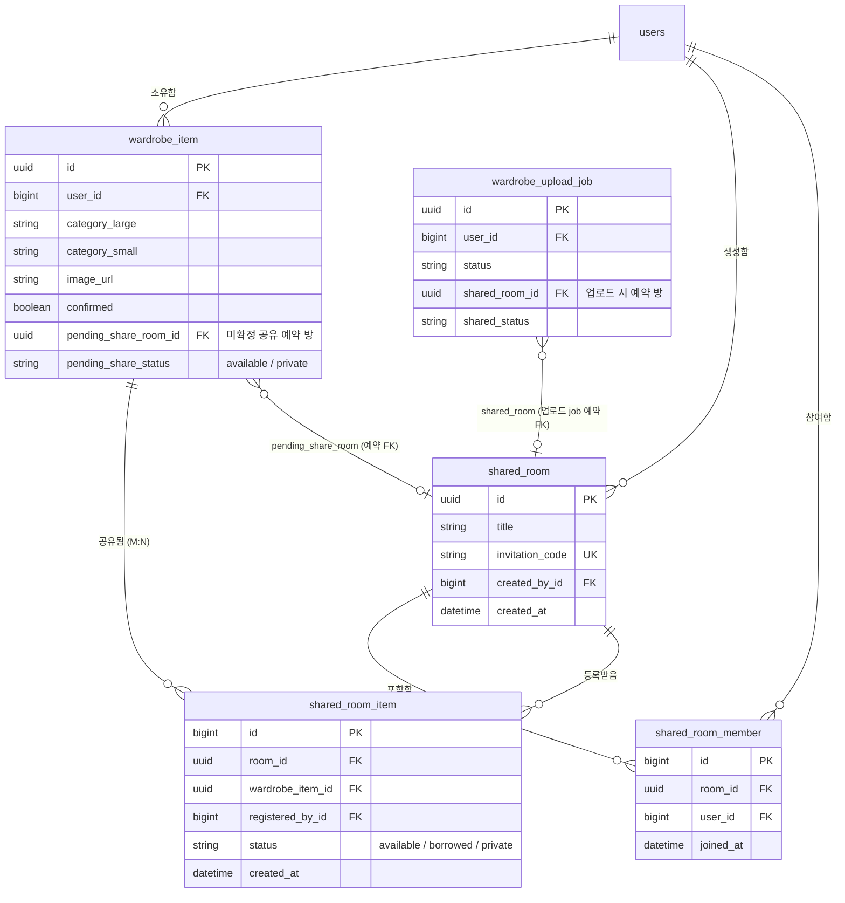

# 공유 옷장 (Shared Wardrobe) 종합 인수인계 & 기술 명세서 (2026-08-16 최종)

> **문서 작성일**: 2026년 08월 16일  
> **대상 브랜치**: `feature/shared-wardrobe-mybuild` (배포 및 모바일/웹 최종 완성) ➔ 포팅 목적지 `feature/shared-wardrobe` / `main`  
> **이전 핸드오프 문서**: [HANDOFF-2026-08-14.md](./HANDOFF-2026-08-14.md)

---

## 1. 개요 및 핵심 변경 사항 요약

본 문서는 공유 옷장 기능의 백엔드 데이터베이스 구조 변경, 예약 서버 이관, 다중 방 공유 지원, PC 웹 vs 모바일 반응형 UI/UX 이원화, 모바일 4x2 갤러리 그리드 높이 고정 및 소유자 뱃지 정돈 작업을 종합적으로 기록한 최신 명세서입니다.

---

## 2. 브랜치 비교 (`main` vs `feature/shared-wardrobe` vs `feature/shared-wardrobe-mybuild`)

| 구분 | `main` | `feature/shared-wardrobe` | `feature/shared-wardrobe-mybuild` (최종) |
| --- | --- | --- | --- |
| **공유 옷장 핵심 기능** | 미지원 (단일 사용자 개인 옷장만 존재) | 기본 공유 옷장 데이터 모델 및 단일 방 공유 기능 구현 | **다중 방 동시 공유 지원 (`sharedRoomIds`) 및 백엔드 서버 예약 처리** |
| **공유 예약 방식** | 해당 없음 | 클라이언트 `secureStore` 기기 단독 예약 (PC-모바일 누락 문제 발생) | **서버 DB 컬럼(`pending_share_room_id`)으로 이관하여 디바이스 불일치 차단** |
| **등록/상세 반응형 UX** | 단순 세로 스택 | 모바일/PC 동일한 UI 노출 | **PC웹(1행 토글, 2행 드롭다운 생성) vs 모바일(사진 상단, 1행 일체형 UI) 완전 이원화** |
| **내 옷 공유 시트 레이아웃** | 해당 없음 | 단일 열/리스트 방식 | **모바일 뷰포트 맞춤 4열 2행 (총 8개) 고정 높이 갤러리 그리드 & 스크롤 연동** |
| **소유자 표시 뱃지** | 해당 없음 | `'나님'` 형태 문구 노출 | **`'나'` (사용자 이름만)로 깔끔하게 텍스트 정돈** |
| **EAS 웹 프로덕션 배포** | 기본 배포 | 기본 배포 | **`https://skncozyhy.expo.app` 웹 프로덕션 자동 배포 완료** |

---

## 3. 데이터베이스 (DB) 변경 사항 및 문제 해결 표

### 3.1 스키마 변천사 & 추가 컬럼 표

| 테이블 명 | 원래 상태 (변경 전) | 변경 내용 (추가/수정 컬럼) | 변경 사유 및 효과 | 근거 |
| --- | --- | --- | --- | --- |
| **`wardrobe_item`** | 개인 소유 컬럼만 존재 | `pending_share_room_id` (FK, NULL), `pending_share_status` (varchar) 추가 | 사진 처리 대기 중(미확정) 공유 방 예약 서버 보관. 기기 저장소 탈피 | ✅ [근거: `api/apps/wardrobe/models.py#L45-L60`] |
| **`wardrobe_upload_job`** | 비동기 이미지 job 상태만 저장 | `shared_room_id` (FK, NULL), `shared_status` (varchar) 추가 | 비동기 이미지 처리 시점부터 공유할 방 정보를 job에 인계 | ✅ [근거: `api/apps/wardrobe/models.py#L110-L125`] |
| **`shared_room`** | 미존재 | `id` (UUID), `title`, `invitation_code`, `created_by_id`, `created_at` 신설 | 공유 옷장 방 생성 및 초대 코드 관리 | ✅ [근거: `api/apps/wardrobe/models.py#L180-L210`] |
| **`shared_room_member`** | 미존재 | `id`, `room_id` (FK), `user_id` (FK), `joined_at` 신설 | 방별 소속 멤버 권한 검증 조인 테이블 | ✅ [근거: `api/apps/wardrobe/models.py#L215-L230`] |
| **`shared_room_item`** | 미존재 | `id`, `room_id` (FK), `wardrobe_item_id` (FK), `registered_by_id`, `status`, `created_at` 신설 | 다중 방 대 아이템 M:N 공유 관계 및 방별 빌림/개인 상태 관리 | ✅ [근거: `api/apps/wardrobe/models.py#L235-L260`] |

---

### 3.2 옷장 & 공유 옷장 데이터베이스 ERD (Mermaid Diagram)

---

## 4. 핵심 기능 추가 및 트러블슈팅 (Troubleshooting) 상세

### 4.1 공유 예약 서버 이관 (기기 SecureStore ➔ DB 컬럼)

- **문제점**:
  - 기존에는 아이템 등록 시 공유 옷장 선택 정보가 모바일 기기 단독 저장소(`SecureStore`)에만 남아, PC 웹에서 등록 후 모바일에서 확정하거나 기기를 변경할 경우 공유 설정이 증발했습니다.
- **해결책**:
  - `wardrobe_item` 및 `wardrobe_upload_job` 테이블에 `pending_share_room_id` 컬럼을 신설했습니다.
  - 확정 API (`PATCH /wardrobe/items/{id}/`) 실행 시 서버에서 예약을 자동으로 소진(`redeem_pending_share`)하여 `shared_room_item` 행을 안전하게 생성하도록 개선했습니다.

---

### 4.2 다중 공유 옷장 방 동시 선택 지원 (1개 ➔ N개 방)

- **문제점**:
  - 이전에는 1개의 옷을 등록할 때 단 1개의 공유 옷장 방만 선택 가능했습니다.
- **해결책**:
  - 프론트엔드 드롭다운 메뉴를 체크박스 다중 선택 방식으로 변경하였습니다.
  - API 보낼 때 `sharedRoomIds: string[]` 배열 파라미터를 지원하도록 모바일/백엔드를 연동하였습니다.

---

### 4.3 내 옷 공유하기 시트 4x2 갤러리 그리드 모바일 높이 고정 및 텍스트 잘림 해결

- **문제점**:
  - 모바일 웹/앱 환경에서 공유 아이템이 9개 이상일 경우, `ScrollView` 세로 행이 계속 아래로 길어져 화면 하단을 뚫고 나갔습니다.
  - 타일 하단 브랜드/상품명 텍스트가 잘리는 현상이 발생했습니다.
- **해결책**:
  - `shared-item-add-sheet.tsx`에서 `useWindowDimensions()`를 사용해 화면 폭 기준 타일 높이와 2행 고정 높이(`twoRowsHeight`)를 동적으로 계산했습니다.
  - `ScrollView`에 `style={{ height: twoRowsHeight, maxHeight: twoRowsHeight, flexGrow: 0 }}`를 부여하여 4x2 그리드 틀 안에서만 스크롤되도록 고정했습니다.
  - 타일 부모의 `overflow: 'hidden'`을 제거하고 `tileHeight` 높이 보정(+26px)을 적용하여 '나이키 에어포~' 텍스트 하단 잘림을 완전히 완치했습니다.

---

### 4.4 PC 웹 vs 모바일 반응형 UX/UI 디자인 이원화

- **요구사항**:
  - **모바일 화면**: 사진보다 위에 공유옷장 토글 박스가 위치하며 (`[1. 공유옷장 박스]` ➔ `[2. 사진]` ➔ `[3. 제목]`), 한 줄(`shareRow`) 일체형 스위치/드롭다운 UI로 작동해야 함.
  - **PC 웹 화면**: 기존 2단 레이아웃 오른쪽 상세열 내부에 위치하며, 1행 스위치 토글 ➔ **toggle ON 되었을 때만 2행에 '공유/등록할 옷장 선택 [v]' 드롭박스가 깔끔하게 노출**되어야 함.
- **해결책**:
  - `useBreakpoint()`의 `isMobile` 스위치 조건을 기반으로 `shareBoxMobile`과 `shareBoxDesktop` 컴포넌트를 완전히 독립 분기하여 PC 웹과 모바일 각각의 요구사항을 100% 충족시켰습니다.

---

### 4.5 소유자 표시 뱃지 문구 정돈

- **문제점**:
  - 공유 옷장 타일 및 착장 시트에서 소유자가 본인일 경우 `'나님'`으로 다소 어색하게 출력되었습니다.
- **해결책**:
  - `closet.tsx`, `item-picker-sheet.tsx`, `saved-look.tsx`, `look-composer.tsx` 전 전반의 `'님'` 접미사를 제거하여 `'나'` (사용자 이름 그대로)만 깔끔하게 노출되도록 정돈했습니다.

---

## 5. 수정된 핵심 코드 파일 목록

| 파일 경로 | 수정 목적 |
| --- | --- |
| `mobile/src/app/(tabs)/item-detail.tsx` | PC웹 2행 드롭다운 복원 & 모바일 사진 상단 1행 일체형 UI 반응형 분기 |
| `mobile/src/app/item-add.tsx` | 등록 화면 PC웹 2행 드롭다운 복원 & 모바일 1행 UI 반응형 분기 |
| `mobile/src/app/(tabs)/closet.tsx` | 방 탭 가로 스크롤 제거(`flexWrap`) 및 소유자 뱃지 `'나님'` ➔ `'나'` 수정 |
| `mobile/src/components/closet/shared-item-add-sheet.tsx` | 4x2 갤러리 그리드 모바일 동적 높이 고정 & 텍스트 잘림 해결 |
| `mobile/src/components/calendar/item-picker-sheet.tsx` | 소유자 표시 뱃지 문구 정돈 |
| `mobile/src/app/(tabs)/saved-look.tsx` | 저장된 착장 내 소유자 표시 문구 정돈 |
| `mobile/src/components/look/look-composer.tsx` | 착장 조합기 내 소유자 표시 문구 정돈 |
| `api/apps/wardrobe/models.py` | `pending_share_room`, `pending_share_status` DB 컬럼 추가 |
| `api/apps/wardrobe/views.py` | 업로드 및 확정 시 서버 예약 소진 서비스 적용 |

---

## 6. 포팅 및 운영 체크리스트

1. **마이그레이션 적용**:
   - `python manage.py migrate` 명령으로 `0010_pending_share_reservation.py` 적용 필요.
2. **EAS 빌드 계정 확인**:
   - `feature/shared-wardrobe-mybuild` 브랜치에는 개발용 EAS 설정(`skncozyhy`)이 들어있으므로, `main` 브랜치로 포팅할 때는 `mobile/app.json`의 permissions 부분만 선별 반영해야 함.
3. **프로덕션 URL**:
   - 프로덕션 웹 배포 URL: [https://skncozyhy.expo.app](https://skncozyhy.expo.app)

---
*작성자: Antigravity AI Assistant (`vosnuevo@gmail.com` 전하영 전담 엔지니어 조수)*  
*기록 시점 버전: `feature/shared-wardrobe-mybuild@4e4adaa`*
