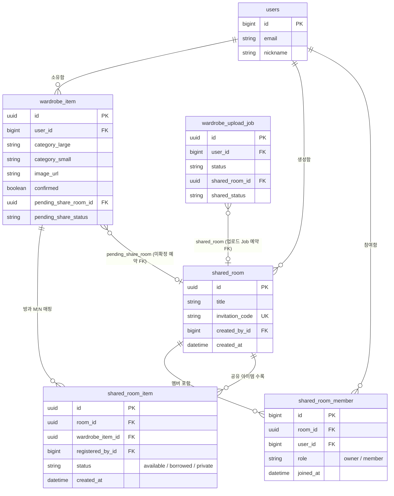

# 공유 옷장 (Shared Wardrobe) 종합 설계 및 구현 명세서

> **작성일**: 2026년 08월 16일  
> **프로젝트**: SKN28-FINAL-1Team 패션 AI 추천 서비스  
> **문서 버전**: v2.0 (최종 완성본)  
> **관련 Jira 이슈**: SCRUM-282 (공유 옷장 백엔드 API), SCRUM-283 (공유 옷장 프론트엔드 UI/UX)  
> **배포 URL**: [https://skncozyhy.expo.app](https://skncozyhy.expo.app)

---

## 1. 개요 및 비즈니스 목적 (Business Purpose)

### 1.1 비즈니스 배경 및 필요성
기존의 개인 옷장 서비스는 사용자 1명의 소유 의류만 관리하고 추천할 수 있는 한계가 있었습니다.  
그러나 현실에서의 패션 소비 및 착장 행위는 가족, 동거인, 친구, 연인 간 **"서로의 옷을 빌려 입거나 코디를 공유하는 행위"**가 빈번하게 일어납니다.

### 1.2 비즈니스 목적 (Objective)
1. **자원 공유 및 활용도 극대화**: 사용자가 보유한 옷을 그룹(가족, 룸메이트, 모임) 단위로 공유하여 활용도를 높입니다.
2. **AI 추천 시너지 강화**: 개인 옷장 아이템뿐만 아니라 참여 중인 공유 옷장의 아이템까지 AI 착장 추천(Today's Look) 및 가상 피팅 대상에 포함시켜 조합의 가짓수를 획기적으로 확장합니다.
3. **사용자 경험(UX) 최적화**: 디바이스(PC 웹 vs 모바일) 스크린 환경에 맞춤화된 반응형 UI와 직관적인 공유 방 관리를 제공합니다.

---

## 2. 핵심 추구 기능 (Core Features)

### 2.1 공유 옷장 방 생성 및 참여 관리
- **방 개설 및 정원 제약**: 로그인한 사용자는 제한 없이 방을 개설할 수 있으며, 방당 **최대 6명**까지 참여 가능합니다 (동시성 제어를 위해 `select_for_update` 행 잠금 적용).
- **초대 코드 및 딥링크**: 방 개설 시 6자리 영대문자+숫자 초대 코드가 자동 생성되며, **24시간 유효 기간**을 가집니다. 카카오톡 공유 피드 템플릿과 딥링크(`invite.tsx`)를 통해 손쉽게 초대를 수락할 수 있습니다.
- **초대 링크 접속 UX 직통 처리**:
  - **미로그인 상태**: 초대 링크 클릭 시 **즉시 로그인 페이지(`/login?redirect=...`)로 자동 이동**하며, 로그인 완료 시 자동으로 원래 초대 링크로 돌아와 가입을 완료합니다.
  - **로그인 상태**: 별도의 수락 버튼 누름 없이 **즉시 초대 수락(`joinSharedRoom`)을 실행하고 해당 초대받은 공유 옷장 방(`/(tabs)/closet?tab=shared&room=roomId`)으로 직통 진입**합니다.
- **멤버 고정 색상 매핑**: 멤버의 가입 순서(`joined_at` 인덱스)에 따라 6가지 고정 파스텔 색상(노랑, 하늘, 연두, 핑크, 보라, 주황)을 부여하여 아이템 소유자를 명확하게 구분합니다.
- **방장 권한 자동 위임**: 방장이 방을 나갈 경우 방을 파괴하지 않고, **가입 일시가 가장 빠른 멤버에게 방장 권한이 자동 승계**됩니다. 남은 멤버가 0명일 때만 방이 자동 삭제됩니다.
- **유연한 탈퇴 정책**: 탈퇴 시 등록했던 아이템을 일괄 삭제할지, 또는 방에 남겨두고 공유자만 NULL(기부)로 변경할지 사용자가 선택할 수 있습니다.

### 2.2 비동기 서버 공유 예약 시스템 (Pending Share Reservation)
- **문제 해결**: 업로드 후 AI 누끼/태깅 처리가 끝날 때까지 아이템이 미확정(`confirmed=false`) 상태로 대기하는 동안, 기존의 기기 저장소(`SecureStore`) 공유 예약 방식은 디바이스 변경이나 브라우저 재접속 시 공유가 누락되는 치명적인 문제가 있었습니다.
- **서버 컬럼 이관**: `wardrobe_item` 및 `wardrobe_upload_job` 테이블에 `pending_share_room_id` 컬럼을 신설하여, 이미지 비동기 처리 및 확정 시점(`PATCH /wardrobe/items/{id}/`)에 서버에서 원자적으로 공유 레코드(`shared_room_item`)를 소진/생성하도록 구축했습니다.

### 2.3 다중 방 동시 공유 지원 (`sharedRoomIds`)
- 아이템 1개를 여러 공유 옷장 방에 동시에 등록할 수 있도록 체크박스 다중 선택 드롭다운 UI와 백엔드 배열 수신 파라미터를 구축하였습니다.

### 2.4 반응형 이원화 UX/UI 디자인 (PC Web vs Mobile)
- **PC 웹버전 (`!isMobile`)**:
  - 아이템 상세 화면: 오른쪽 상세 정보 열 내부에 공유 옷장 박스 위치.
  - 아이템 등록/상세: 1행 `[공유 옷장]` 스위치 토글 ➔ **toggle ON 시에만 아래 2행에 '등록/공유할 옷장 선택 [v]' 드롭박스가 깔끔하게 생성**되는 2행 구조 적용.
- **모바일 버전 (`isMobile`)**:
  - 아이템 상세 화면: 사진 영역 상단에 공유 옷장 박스를배치 (`[1. 공유옷장]` ➔ `[2. 사진]` ➔ `[3. 제목]`).
  - 한 줄(`shareRow`) 스위치 토글 + 오른쪽 드롭다운 버튼 일체형 박스 UI 제공.

### 2.5 내 옷 공유하기 4x2 갤러리 그리드 모바일 대응
- 공유 옷장에서 내 옷 공유하기 클릭 시 나오는 시트에서 `useWindowDimensions()`를 사용해 화면 폭에 맞춘 타일 높이와 2행 고정 높이(`twoRowsHeight`)를 동적으로 계산하여, **9개 이상 아이템 시에도 4x2 틀 안에서만 깔끔하게 세로 스크롤**되도록 고정했습니다.

### 2.6 소유자 뱃지 정돈
- 공유 옷장 타일 및 착장 시트 등에서 사용자 소유자 문구를 `'나님'`에서 `'나'`(사용자 이름 그대로)로 정돈하여 가독성을 향상시켰습니다.

---

## 3. 데이터베이스 설계 및 ERD (Database & ERD)

### 3.1 Django 데이터 모델 명세

#### 1. `SharedWardrobeRoom` (`shared_room`) — 공유 옷장 방
| 필드명 | 타입 | 제약조건 | 설명 |
| --- | --- | --- | --- |
| `id` | UUIDField | PK, default=uuid4 | 방 고유 식별자 |
| `title` | CharField(100) | Not Null | 방 이름 |
| `invite_code` | CharField(6) | Unique, Nullable | 6자리 초대 코드 |
| `code_expires_at` | DateTimeField | Nullable | 초대 코드 만료 일시 (발급 + 24h) |
| `created_by` | FK(User) | CASCADE | 방 개설자 |
| `created_at` | DateTimeField | auto_now_add | 생성 일시 |

#### 2. `SharedWardrobeMember` (`shared_room_member`) — 참여 멤버십
| 필드명 | 타입 | 제약조건 | 설명 |
| --- | --- | --- | --- |
| `id` | BigAutoField | PK | 멤버십 식별자 |
| `room` | FK(SharedWardrobeRoom) | CASCADE | 소속 방 |
| `user` | FK(User) | CASCADE | 참여 사용자 |
| `role` | CharField(10) | default='member' | `owner` / `member` |
| `joined_at` | DateTimeField | auto_now_add | 가입 일시 (방장 승계 및 색상 기준) |

#### 3. `SharedWardrobeItem` (`shared_room_item`) — 방 ↔ 옷 M:N 공유 연결
| 필드명 | 타입 | 제약조건 | 설명 |
| --- | --- | --- | --- |
| `id` | UUIDField | PK, default=uuid4 | 공유 레코드 식별자 |
| `room` | FK(SharedWardrobeRoom) | CASCADE | 소속 방 |
| `wardrobe_item` | FK(WardrobeItem) | CASCADE | 원본 개인 옷 참조 |
| `registered_by` | FK(User) | SET_NULL, Nullable | 공유 등록자 (탈퇴 기부 시 NULL) |
| `status` | CharField(15) | default='available' | `available` (공유가능) / `borrowed` (대여중) / `private` (나만보기) |
| `created_at` | DateTimeField | auto_now_add | 공유 등록 일시 |

#### 4. `WardrobeItem` 신규 추가 예약 컬럼 (`wardrobe_item`)
| 필드명 | 타입 | 제약조건 | 설명 |
| --- | --- | --- | --- |
| `pending_share_room` | FK(SharedWardrobeRoom) | SET_NULL, Nullable | 비동기 이미지 처리 중 공유 예약 방 |
| `pending_share_status` | CharField(15) | Nullable | 비동기 이미지 처리 중 공유 예약 상태 |

---

### 3.2 ERD 다이어그램 (Mermaid visual model)



---

## 4. 백엔드 API 명세 (API Specifications)

모든 API 엔드포인트는 `/api/v1/` 접두사를 사용합니다.

| # | 기능 | HTTP 메서드 및 경로 | 요청 본문 (Body) / 파라미터 | 주요 처리 로직 |
| --- | --- | --- | --- | --- |
| 1 | 공유 방 목록 조회 | `GET /api/v1/shared-wardrobes/` | None | 내가 가입한 모든 방 목록 및 멤버 정보 반환 |
| 2 | 공유 방 개설 | `POST /api/v1/shared-wardrobes/` | `{ "title": "우리집 옷장" }` | 방 생성 후 6자리 초대 코드 및 개설자 owner 설정 |
| 3 | 초대 코드 재발급 | `POST /api/v1/shared-wardrobes/{room_id}/refresh-code/` | None | owner 전용. 기존 코드 무효화 후 새 24h 코드 발급 |
| 4 | 방 참여 (초대 코드 수락) | `POST /api/v1/shared-wardrobes/join/` | `{ "invite_code": "AB12CD" }` | 6명 정원 및 24h 만료 검증 후 가입 처리 |
| 5 | 공유 방 아이템 목록 | `GET /api/v1/shared-wardrobes/{room_id}/items/` | None | 해당 방에 공유 등록된 옷 목록 반환 |
| 6 | 아이템 공유 등록 | `POST /api/v1/shared-wardrobes/{room_id}/items/` | `{ "wardrobe_item_id": "...", "status": "available" }` | 원본 아이템 참조 기반 공유 레코드 생성 |
| 7 | 아이템 공유 해제 | `DELETE /api/v1/shared-wardrobes/{room_id}/items/{item_id}/` | None | 공유 레코드 삭제 (원본 개인 옷은 보존) |
| 8 | 공유 방 탈퇴 | `DELETE /api/v1/shared-wardrobes/{room_id}/leave/` | `{ "delete_my_items": true/false }` | 방장 자동 위임 로직 실행 및 아이템 삭제/기부 처리 |

---

## 5. 프론트엔드 구현 및 반응형 설계

### 5.1 파일 구조 및 역할

```
mobile/src/
├── app/
│   ├── (tabs)/
│   │   ├── closet.tsx             # 옷장 메인 (내 옷장/공유 옷장 탭, 방 wrap 칩, 아이템 그리드)
│   │   ├── item-detail.tsx        # 옷 상세 (PC웹 2행 드롭다운 / 모바일 상단 1행 일체형 반응형 UI)
│   │   └── saved-look.tsx         # 저장된 코디 (소유자 뱃지 표시)
│   ├── item-add.tsx               # 옷 등록 (PC웹 2행 드롭다운 / 모바일 1행 일체형 반응형 UI)
│   └── invite.tsx                 # 딥링크 초대 수락 화면
├── components/
│   ├── closet/
│   │   ├── shared-space-flow.tsx  # 공유 방 멤버 아바타 및 카카오 피드 초대 링크
│   │   ├── shared-item-add-sheet.tsx # 내 옷 공유하기 4x2 갤러리 그리드 시트
│   │   └── item-tag-sheet.tsx     # 태그 및 속성 편집 시트
│   └── look/
│       └── look-composer.tsx      # 코디 조합기 (소유자 뱃지 표시)
└── hooks/
    └── use-breakpoint.ts          # isMobile, isDesktop 뷰포트 반응형 훅
```

---

## 6. 검증 및 프로덕션 배포 현황

### 6.1 검증 결과 (Automated & Manual Verification)
1. **백엔드 단위 테스트**: `PendingShareReservationTests` 5개 케이스 포함 `apps.wardrobe` 전체 33개 테스트 케이스 **100% 통과 (OK)**.
2. **타입 안전성**: `npx tsc --noEmit` 실행 결과 **타입 에러 0개**.
3. **반응형 뷰포트 검증**:
   - PC웹 (1280px 이상): 2단 상세 레이아웃 우측열 내 1행 스위치 + toggle ON 시 2행 드롭다운 동작 확인.
   - 모바일 (768px 이하): 사진 상단 1행 일체형 토글 박스 및 4x2 갤러리 그리드 스크롤 동작 확인.

### 6.2 프로덕션 배포 현황
- **플랫폼**: Expo Application Services (EAS) Production Web
- **배포 URL**: [https://skncozyhy.expo.app](https://skncozyhy.expo.app)
- **최신 번들 커밋**: `feature/shared-wardrobe-mybuild@7d0754d`

---
*SKN28-FINAL-1Team Shared Wardrobe Official Specification*
